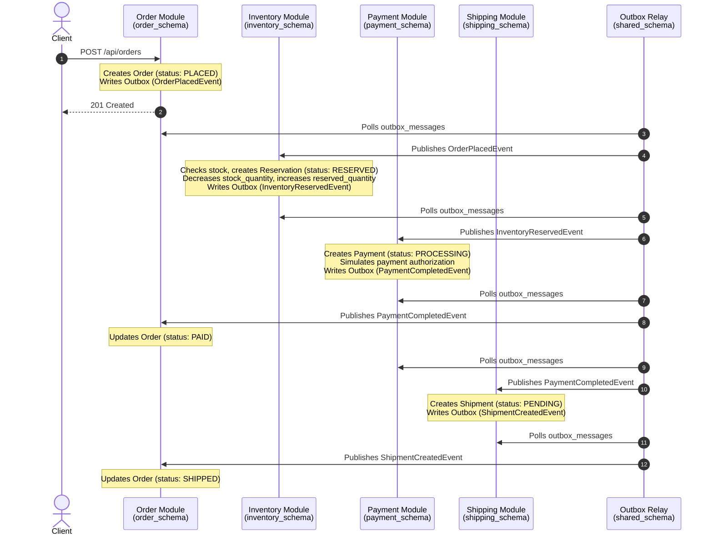
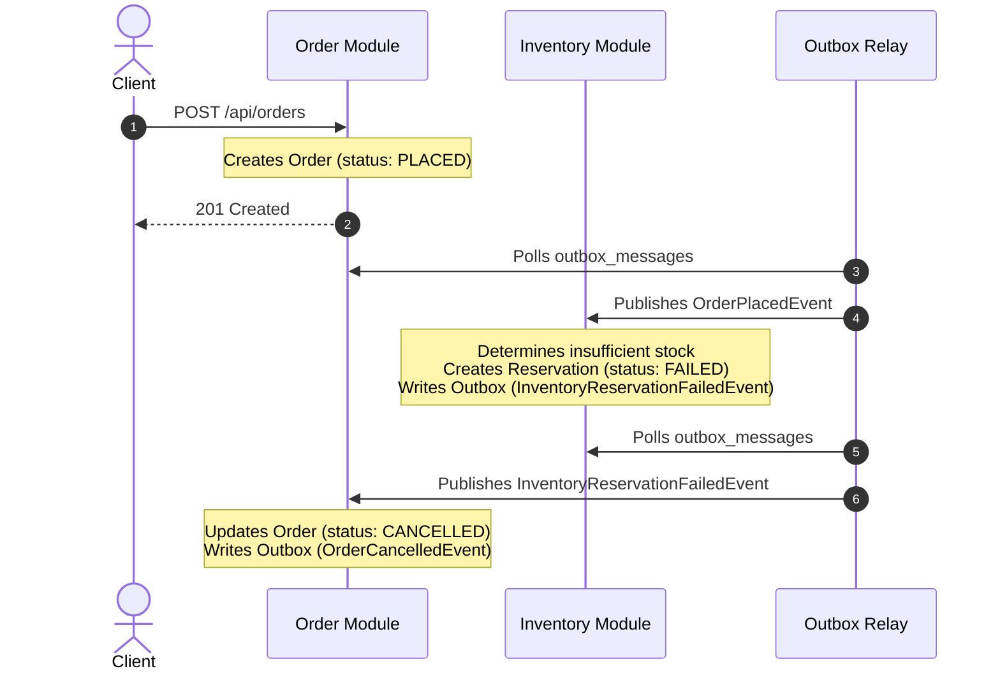
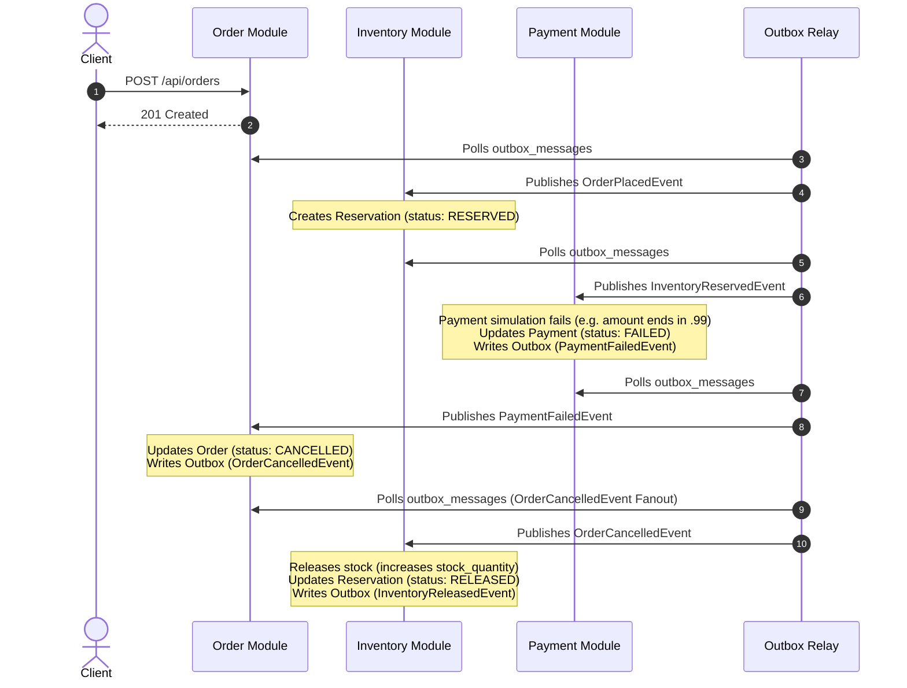
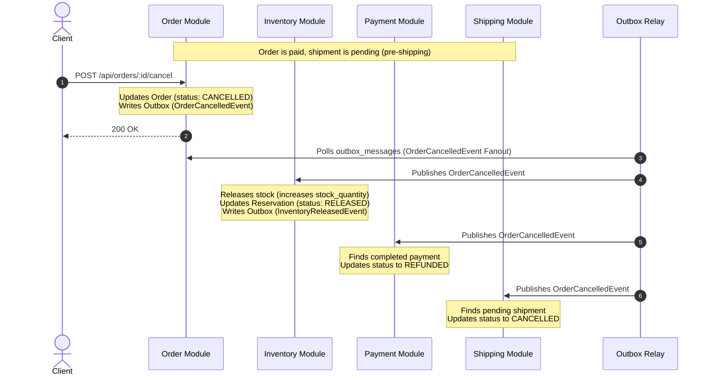

# Event Flow, Saga Choreography & Routing Map

This document serves as the master architectural reference for event-driven choreography, RabbitMQ routing mechanics, database state transitions, and Saga compensation flows within the modular monolith order engine.

---

## 1. RabbitMQ Topic Routing & Parallel Consumption (Pub/Sub)

In a traditional message broker pattern, developers often ask: **How can multiple modules process the same domain event simultaneously without interfering with one another?**

Our system achieves this by utilizing RabbitMQ's **Topic Exchanges** paired with isolated, per-module queues.

### Topic Exchange Routing Mechanics
1. **Topic Exchanges (`*-exchange`)**: Rather than routing messages to a single queue, publishers publish messages to an exchange with a specific **routing key** (e.g., `payment.completed`).
2. **Per-Module Queues (`*-queue`)**: Each distinct module (e.g., `order`, `shipping`, `notification`) declares and owns its unique queue (e.g., `order-queue`, `shipping-queue`, `notification-queue`).
3. **Queue Bindings**: During startup, each module's consumer binds its queue to interest-specific exchanges using a **binding key** or pattern:
   - `order-queue` binds to `payment-exchange` with routing key `payment.completed`
   - `shipping-queue` binds to `payment-exchange` with routing key `payment.completed`
   - `notification-queue` binds to `payment-exchange` with routing key `payment.completed`
4. **Message Copying**: When the payment module publishes `PaymentCompletedEvent` to `payment-exchange`, RabbitMQ evaluates the routing key against all bindings. It **clones** the message envelope and delivers a copy to the `order-queue`, `shipping-queue`, and `notification-queue` **simultaneously**.

```
                           +------------------+
                           |  Payment Module  |
                           +--------+---------+
                                    |
                    Publishes PaymentCompletedEvent
                     (Routing Key: payment.completed)
                                    |
                                    v
                         +-------------------+
                         |  payment-exchange | (Topic Exchange)
                         +----+----+----+----+
                              |    |    |
          +-------------------+    |    +-------------------+
          | (routing match)        | (routing match)        | (routing match)
          v                        v                        v
   +--------------+         +--------------+         +--------------------+
   | order-queue  |         |shipping-queue|         |notification-queue  |
   +------+-------+         +------+-------+         +---------+----------+
          |                        |                           |
          v                        v                           v
  +---------------+        +---------------+         +--------------------+
  |  Order Module |        |Shipping Module|         |Notification Module |
  |   (Consumer)  |        |   (Consumer)  |         |     (Consumer)     |
  +---------------+        +---------------+         +--------------------+
```

### Decoupled Parallel Consumption
This design guarantees that:
- **Decoupling**: The Payment module does not know or care that the Shipping or Order modules are listening. It merely announces the fact that a payment completed.
- **Parallel Processing**: The Order module can process the payment status update at the same time the Shipping module is generating a pending shipment.
- **Fault Isolation**: If the Shipping module's consumer is temporarily offline, the message remains safely in the `shipping-queue` while the `order-queue` and `notification-queue` process the event immediately.

---

## 2. Sequence Diagrams & Choreography Saga Paths

### Flow A: The Happy Path (Order Placement to Shipping)



---

### Flow B: Out of Stock Path (Graceful Fail)



---

### Flow C: Payment Failed Path (Saga Compensation)



---

### Flow D: Manual Order Cancellation Path (User-Initiated Rollback)



---

## 3. Detailed Topology Registry & Routing Contracts

The following table summarizes the routing rules, exchange configurations, database side-effects, and follow-up triggers for all events in the system:

| Event Type | Exchange | Routing Key | Producer | Consumers | DB State Transitions (Active Schema) | Successor / Compensation Trigger |
| :--- | :--- | :--- | :--- | :--- | :--- | :--- |
| **`OrderPlacedEvent`** | `order-exchange` | `order.placed` | **Order** | **Inventory**, Notification | **Order**: creates order (`status: PLACED`). | Triggers **Inventory** check. |
| **`InventoryReservedEvent`** | `inventory-exchange` | `inventory.reserved` | **Inventory** | **Payment**, Notification | **Inventory**: reservation (`status: RESERVED`), product `stock_quantity` down, `reserved_quantity` up. | Triggers **Payment** simulation. |
| **`InventoryReservationFailedEvent`** | `inventory-exchange` | `inventory.reservation-failed` | **Inventory** | **Order**, Notification | **Inventory**: reservation (`status: FAILED`). | Triggers **Order** to cancel itself and publish `OrderCancelledEvent`. |
| **`InventoryReleasedEvent`** | `inventory-exchange` | `inventory.released` | **Inventory** | Notification | **Inventory**: reservation (`status: RELEASED`), product `stock_quantity` up, `reserved_quantity` down. | Terminal event. |
| **`PaymentCompletedEvent`** | `payment-exchange` | `payment.completed` | **Payment** | **Order**, **Shipping**, Notification | **Payment**: payment (`status: COMPLETED`). | Triggers **Order** to update to `PAID` & **Shipping** to provision shipment. |
| **`PaymentFailedEvent`** | `payment-exchange` | `payment.failed` | **Payment** | **Order**, Notification | **Payment**: payment (`status: FAILED`). | Triggers **Order** to cancel itself and publish `OrderCancelledEvent`. |
| **`ShipmentCreatedEvent`** | `shipping-exchange` | `shipping.created` | **Shipping** | **Order**, Notification | **Shipping**: shipment (`status: PENDING`). | Triggers **Order** to transition status to `SHIPPED`. |
| **`ShipmentDeliveredEvent`** | `shipping-exchange` | `shipping.delivered` | **Shipping** | **Order**, Notification | **Shipping**: shipment (`status: DELIVERED`). | Triggers **Order** to transition status to `DELIVERED`. |
| **`OrderCancelledEvent`** | `order-exchange` | `order.cancelled` | **Order** | **Inventory**, **Payment**, **Shipping**, Notification | **Order**: order (`status: CANCELLED`). | Triggers **Inventory** stock release, **Payment** refund (if paid), and **Shipping** cancellation. |

---

## 4. Operational Integrity (Inbox/Outbox Patterns)

To prevent race conditions, message loss, or split-brain states under heavy concurrent loads, the system enforces two primary structural constraints:

1. **Transactional Outbox**: All domain events are saved in the module's local PostgreSQL schema (`outbox_messages` table) in the *same* database transaction that updates the core entity status.
   - If the database write fails, the entire transaction rolls back; no message is ever sent to RabbitMQ.
   - The outbox message relay runs as a background processor, polling unpublished outbox messages, publishing them with publisher-confirms to RabbitMQ, and marking them published on success.
2. **Transactional Inbox**: Consumers use an inbox-deduplication table (`inbox_messages` table) matching `messageId` and `handlerName`.
   - If a duplicate message is received due to network retries, the database unique key constraint blocks execution, ensuring **idempotent message processing**.
