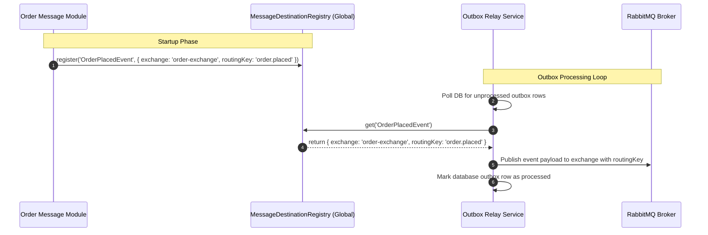
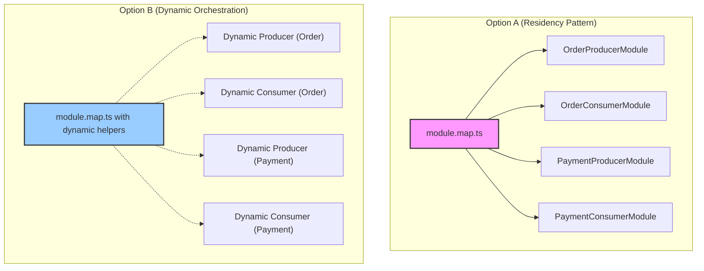
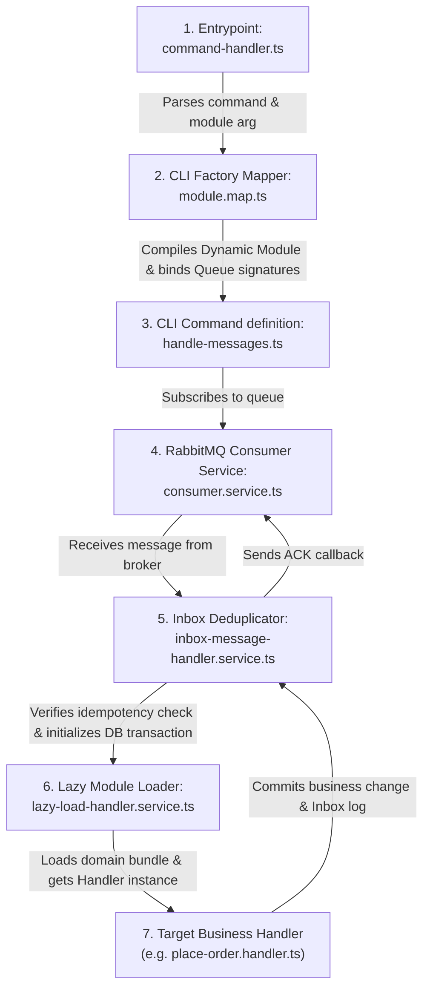

# RabbitMQ & Shared Infrastructure Setup Guide

This guide is a comprehensive, production-grade deep dive into the event-driven RabbitMQ infrastructure, transactional messaging patterns, CLI orchestration, and global exception mappers implemented in the `event-driven-order-engine`. It is designed to take you from a beginner to a pro in resilient, distributed architecture.

---

## 1. Introduction to Event-Driven Bounded Contexts

### The Mental Model
When building traditional monolithic applications, modules talk to each other directly via function calls. In a microservices or modular monolith architecture, we want modules (like **Order**, **Payment**, and **Inventory**) to be completely decoupled. If the **Order** module calls the **Payment** module directly over HTTP or via a direct database query, we introduce tight coupling: if the **Payment** module goes down, the **Order** module fails too.

To solve this, we use **Event-Driven Architecture (EDA)**. Instead of calling another module, a module performs its local business action and publishes a **Domain Event** (e.g., `OrderPlacedEvent`) to a message broker (RabbitMQ). Any interested module subscribes to this event and reacts to it independently. This creates a highly resilient system where services can fail, scale, and restart without bringing down the rest of the application.

---

## 2. Transactional Messaging Patterns

To build resilient, eventually consistent microservices, we must solve two critical distributed systems problems: **The Dual-Write Problem** and **Idempotent Consumption**.

```
                           THE DUAL-WRITE PROBLEM
                           
                  ┌─────────────────────────────────────┐
                  │          Client Request             │
                  └──────────────────┬──────────────────┘
                                     │
                 ┌───────────────────┴───────────────────┐
                 ▼                                       ▼
    ┌─────────────────────────┐             ┌─────────────────────────┐
    │  Write to PostgreSQL    │             │   Publish to RabbitMQ   │
    │  (State: Order Created) │             │  (Event: OrderPlaced)   │
    └─────────────────────────┘             └─────────────────────────┘
                 │                                       │
      If DB write succeeds, but               If publish succeeds, but
      network/broker fails, the               database transaction rolls
      event is lost forever.                  back, a phantom event is sent.
```

### 2.1 The Dual-Write Problem & Transactional Outbox
*   **What**: The dual-write problem occurs when a microservice needs to update a database and publish an event to a message broker. Because these are two separate network calls, they cannot participate in a single distributed transaction.
*   **Why**: A network call to RabbitMQ cannot participate in a PostgreSQL database transaction. If the database transaction commits but the network fails before publishing, the message is lost. If the message is published but the database transaction rolls back, we publish a "phantom event" representing an action that never actually occurred.
*   **How**: Instead of sending the message to RabbitMQ directly during the business request, we save the message details inside a table called `outbox_messages` as part of the *same* database transaction as the business entity changes. This guarantees that either both succeed, or both roll back. A separate background process (the **Outbox Relay**) polls this table, publishes messages with publisher confirmations, and marks them as `processed = true`.

#### Detailed Outbox Workflow
1. **Client Action**: A user clicks "Buy". The **Order HTTP Controller** receives the request and forwards it to the **Place Order Handler**.
2. **Atomic Write**: The handler creates the `Order` entity and creates an `OrderPlacedEvent`. Using MikroORM's Unit of Work, it writes the `Order` record to the `orders` table and writes the serialized event to the `outbox_messages` table. This happens in a single transaction block (`BEGIN ... COMMIT`).
3. **Relay Poller**: Every few seconds, the **Outbox Relay Service** runs a background query using `SELECT FOR UPDATE SKIP LOCKED` to fetch a batch of unprocessed outbox records.
    * *Why Skip Locked?* If you run multiple instances of the backend, they will poll the database concurrently. `SKIP LOCKED` ensures that Instance A locks its batch and Instance B skips those locked rows, preventing duplicate processing and database bottlenecks.
4. **Publish & Confirm**: The relay publishes the serialized payload to RabbitMQ. It waits for **Publisher Confirmations** (an acknowledgment from RabbitMQ that the message was received and written to disk).
5. **Mark Processed**: Once RabbitMQ confirms the message is safe, the relay updates the outbox row: `processed = true`, setting the `processed_at` timestamp.

#### Outbox Database Row Example
If a client places an order, the database transaction writes the following row to `outbox_messages`:
```json
{
  "id": "a5b81b22-83b6-4dfb-91cc-a720df38c5b0",
  "created_at": "2026-06-26T10:24:43.000Z",
  "updated_at": "2026-06-26T10:24:43.000Z",
  "event_type": "OrderPlacedEvent",
  "payload": {
    "orderId": "d748f219-c09a-41df-a720-33bfa8a9c221",
    "customerId": "cust_8213",
    "totalAmount": 129.99
  },
  "exchange": "order-exchange",
  "routing_key": "order.placed",
  "correlation_id": "corr_f3b9281a-4921-4f9b",
  "causation_id": "caus_f3b9281a-4921-4f9b",
  "processed": false,
  "processed_at": null
}
```

---

### 2.2 Idempotency & Transactional Inbox
*   **What**: A mechanism that guarantees a message is processed exactly once by a given handler, even if it is received multiple times.
*   **Why**: Message brokers like RabbitMQ guarantee **at-least-once delivery**. A consumer might successfully process a message but crash or experience a network timeout *before* it can send the acknowledgment (`ACK`) back to RabbitMQ. RabbitMQ will then redeliver the message. Without idempotency, this would execute side effects (like charging a credit card or deducting inventory) multiple times.
*   **How**: When a message is received, the consumer checks if an entry with the composite key `(message_id, handler_name)` exists in the `inbox_messages` table. If it exists, the message is immediately acknowledged and skipped. If not, the handler executes, and the inbox log entry is inserted within the *same* database transaction as the handler's business side effects.

#### Detailed Inbox Workflow
1. **Message Arrives**: RabbitMQ delivers a message envelope containing `OrderPlacedEvent` to the **Consumer Service**.
2. **De-duplication Check**: Before executing the event handler, the consumer queries the `inbox_messages` table:
   ```sql
   SELECT EXISTS(SELECT 1 FROM inbox_messages WHERE message_id = 'uuid' AND handler_name = 'ReserveInventoryHandler');
   ```
3. **Case A (Duplicate)**: If the query returns `true`, the consumer prints a warning, sends `basic.ack` to RabbitMQ, and terminates processing immediately. No business logic is run again.
4. **Case B (New Message)**: If the query returns `false`, the consumer starts a new database transaction.
    * It executes `ReserveInventoryHandler`, which updates the product stocks.
    * It inserts a log entry into `inbox_messages` recording the successful execution of `ReserveInventoryHandler` for this `message_id`.
    * It commits the transaction. If either the inventory update or the log entry insert fails, the whole transaction rolls back, and the message is not marked as processed, ensuring RabbitMQ can safely redeliver it.
5. **Final ACK**: The consumer sends a `basic.ack` to RabbitMQ, clearing the message from the queue.

#### Inbox Log Row Example
```json
{
  "id": "e81d7410-b9cc-432d-961e-841da92819cd",
  "message_id": "a5b81b22-83b6-4dfb-91cc-a720df38c5b0",
  "handler_name": "ReserveInventoryOnOrderPlacedHandler",
  "event_type": "OrderPlacedEvent",
  "created_at": "2026-06-26T10:25:01.000Z",
  "updated_at": "2026-06-26T10:25:01.000Z"
}
```

---

## 3. File-by-File Explanation

### 3.1 Core Event Contracts (`modules/shared/src/domain/`)

#### `domain-event.interface.ts`
*   **What**: An interface defining the structure of a Domain Event (e.g., `OrderPlacedEvent`).
*   **Why**: Enforces uniformity. If every developer created events with different structures, writing a generic outbox relay or logger would be impossible.
*   **How**: All domain events must expose the date they occurred, their name, and their data properties.

#### `command.interface.ts` & `query.interface.ts`
*   **What**: Interfaces representing the inputs for Commands (intent to change state) and Queries (intent to read state).
*   **Why**: Implements the Command Query Responsibility Segregation (CQRS) pattern. It prevents the mixing of read-only logic with write/mutation logic, improving code maintainability.
*   **How**: Forces you to write clear, command-specific classes (e.g. `ShipOrderCommand`) which are then handled by dedicated handlers.

#### `message-envelope.interface.ts`
* **What**: The standard JSON metadata envelope wrapped around all message payloads.
* **Why**: Standardizes tracing, message identification, idempotency, and validation across all services.
* **How/Example**:
    ```typescript
    export interface MessageEnvelope<T = any> {
      messageId: string;      // Unique UUID for this message instance
      correlationId: string;  // Traces the entire flow across services
      causationId?: string;   // ID of the message that caused this message
      eventType: string;      // e.g. "OrderPlacedEvent"
      occurredAt: string;     // ISO timestamp
      payload: T;             // Actual event data
    }
    ```

A **DomainEvent** represents a business event (e.g., `OrderPlaced`) generated by the domain layer. Before being published to RabbitMQ, it is wrapped inside a **MessageEnvelope**, which adds messaging metadata required for reliable communication. Consumers and the **Inbox pattern** receive the `MessageEnvelope` (not the `DomainEvent`) because they require fields such as `messageId`, `correlationId`, and `causationId` for deduplication and tracing. The actual `DomainEvent` is then extracted from the `payload` and processed by the application logic.

**Example**

```
Customer Places Order
        │
        ▼
OrderPlaced
messageId = M1
correlationId = C100
causationId = -
        │
        ▼
InventoryReserved
messageId = M2
correlationId = C100
causationId = M1
        │
        ▼
PaymentSucceeded
messageId = M3
correlationId = C100
causationId = M2
```

- **`messageId`** uniquely identifies each message and is used by the **Inbox pattern** to detect and ignore duplicate deliveries.
- **`correlationId`** (`C100`) remains the same for all messages in the order workflow, allowing the entire saga to be traced across services.
- **`causationId`** links each message to the one that directly triggered it (e.g., `PaymentSucceeded` was caused by `InventoryReserved`), enabling parent-child event tracing for debugging and auditing.

### 3.2 Database Persistence & Domain Entities

#### `inbox-message.entity.ts` (`modules/shared/src/domain/inbox/`) & `outbox-message.entity.ts` (`modules/shared/src/domain/outbox/`)
*   **What**: Database entities representing the schemas of the inbox and outbox tables.
*   **Why**: Defines our TypeScript domain entities mapped to the PostgreSQL database schema.
*   **How**: Implemented using MikroORM. We specify indices on `processed` (for outbox polling speed) and a unique composite key on `inbox_messages` (`message_id` + `handler_name`) to prevent race conditions at the database level.

#### `inbox-message.repository.ts` & `outbox-message.repository.ts` (`modules/shared/src/infrastructure/repository/`)
*   **What**: Classes containing queries to load/save inbox and outbox records.
*   **Why**: Decouples SQL/ORM-specific queries from business logic.
*   **How**: Inherits from MikroORM's `EntityRepository`. For example, `OutboxMessageRepository` includes:
    ```typescript
    async findUnprocessed(limit: number): Promise<OutboxMessage[]> {
      return this.find({ processed: false }, {
        limit,
        orderBy: { createdAt: 'ASC' },
        // pessimistic write lock to prevent multiple relayer instances processing the same row
        lockMode: LockMode.PESSIMISTIC_WRITE_OR_FAIL
      });
    }
    ```

---

### 3.3 RabbitMQ Core Engine (`modules/shared/src/infrastructure/message-bus/rabbitmq/config/`)

#### `rabbitmq.interface.ts` & `rabbitmq-config.interface.ts`
* **What**: Type definition files that define the shape of valid RabbitMQ configurations (e.g., structure of connection strings, exchanges, queues, and routing keys).
* **Why**: Enforces type safety. Instead of passing raw, error-prone configuration strings around, these interfaces ensure you don't typo property names (like `durable`).
* **How**: Developers get auto-completion and compile-time checks, ensuring configuration errors are caught immediately rather than causing runtime crashes.

---

#### `rabbitmq-config.service.ts` & `rabbitmq-runtime-config.service.ts`
* **What**: These two files manage configuration loading and runtime overrides:
  * **`RabbitmqConfigService`**: Loads and validates environment variables (like `RABBITMQ_URL` or queue prefetch limits) and handles fallback default settings. It also merges module-specific options.
  * **`RabbitmqRuntimeConfig`**: A helper class acting as a **Runtime Overrides Container**—think of it as a temporary, in-memory notepad. It holds custom configuration parameters (like specific queue or exchange names) that we apply programmatically *after* the app has started up, overriding the default environment settings.
* **Why**: Separate environment-based configuration loading from dynamic startup adjustments. This is crucial for:
  1. **Dynamic CLI workers**: We run different worker daemons (like `npx ts-node command-handler.ts handle-messages --module order`) from the same codebase. The parsed CLI options (e.g. queue and exchange names) are set directly into the `RabbitmqRuntimeConfig` container.
  2. **Loose coupling**: The connection service doesn't need to know how or where the overrides came from; it simply reads the merged configuration.
  3. **Easier testing**: You can easily inject mock runtime config overrides inside integration tests without modifying process environment variables.
* **How**: `RabbitmqConfigService` reads environment keys from NestJS `ConfigService`. It then calls `runtimeConfig.mergeWithBase()` to combine the environment defaults with any runtime adjustments.

---

#### `rabbitmq-connection.service.ts`
* **What**: The actual connector class that establishes the long-running TCP connection to the RabbitMQ broker using the `amqplib` library.
* **Why**: `amqplib` does not reconnect out of the box. If the network drops, your app is disconnected permanently. This class adds auto-reconnection logic and channel health management.
* **How**: 
  * It opens a connection using the raw DSN URL string and parameters (like `heartbeat`).
  * It listens for connection `close` or `error` events and automatically initiates a reconnect loop using exponential backoff to avoid hammering RabbitMQ.
  * It exposes helper methods like `publish()`, `retry()`, and `deadLetter()`.

---

#### `rabbitmq-configurer.service.ts`
* **What**: A service that declares exchanges, queues, and routing bindings inside RabbitMQ on application startup (known as asserting the topology).
* **Why**: RabbitMQ requires exchanges and queues to exist before you can publish to or consume from them. Doing this automatically on startup prevents "not found" errors and guarantees that the correct message topology is always in place.
* **How**:
  It defines two main methods that interact with `RabbitmqConnectionService`:
  
##### 1. `publisherTopologyConfigurer()`
This function is responsible for preparing the message broker for **sending (publishing) events**. 

* **The Code**:
  ```typescript
  async publisherTopologyConfigurer() {
    if (this.config.primaryQueueExchange) {
      await this.connection.exchange(
        this.config.primaryQueueExchange,
        this.config.primaryQueueExchangeType || 'topic',
      );
    }
  }
  ```
* **Step-by-Step Explanation**:
  - **Check Config**: It checks if a `primaryQueueExchange` name is configured (e.g., `'order-exchange'`).
  - **Create Exchange**: If configured, it calls `this.connection.exchange(name, type)`. This tells RabbitMQ to establish the exchange. If the exchange already exists, RabbitMQ does nothing. If it does not, RabbitMQ creates it with type `'topic'` (allowing routing keys with wildcards, e.g., `order.placed`).
* **Why we need this**: Publishers send messages to Exchanges (not directly to Queues). Asserting the exchange ensures the publisher doesn't throw a "not found" exception when trying to publish its first event.

---

##### 2. `consumerTopologyConfigurer(signatureTypes: string[] = [])`
This function is responsible for preparing the message broker for **receiving (consuming) events**. It dynamically binds the primary queue to the exchanges and routing keys of all consumed signature types.

* **The Code**:
  ```typescript
  async consumerTopologyConfigurer(signatureTypes: string[] = []) {
    // 1. Declare the Retry Exchange
    if (this.config.retryQueueExchange) {
      await this.connection.exchange(
        this.config.retryQueueExchange,
        this.config.retryQueueExchangeType || 'direct',
      );
    }
    // 2. Declare the Primary Exchange
    if (this.config.primaryQueueExchange) {
      await this.connection.exchange(
        this.config.primaryQueueExchange,
        this.config.primaryQueueExchangeType || 'topic',
      );
    }

    // 3. Declare the Primary Queue
    if (this.config.primaryQueue && this.config.primaryQueueExchange) {
      await this.connection.queue(
        this.config.primaryQueueExchange,
        this.config.primaryQueue,
        { durable: true },
        this.config.primaryQueueBindingKey || '',
      );
    }

    // 4. Dynamically Bind Consumer to Registered Signature Types
    for (const signatureType of signatureTypes) {
      const destination = this.messageDestinationRegistry.get(signatureType);
      if (destination) {
        // Assert the target event's exchange
        await this.connection.exchange(
          destination.exchange,
          'topic',
        );
        // Bind primary queue to that exchange with routing key
        if (this.config.primaryQueue) {
          console.log(`[Topology] Binding queue ${this.config.primaryQueue} to exchange ${destination.exchange} with routing key ${destination.routingKey}`);
          await this.connection.queue(
            destination.exchange,
            this.config.primaryQueue,
            { durable: true },
            destination.routingKey,
          );
        }
      }
    }

    // 5. Declare and bind the Retry Queue
    if (this.config.retryQueue && this.config.retryQueueExchange) {
      await this.connection.queue(
        this.config.retryQueueExchange,
        this.config.retryQueue,
        {
          durable: true,
          deadLetterExchange: this.config.primaryQueueExchange,
          messageTtl: this.config.retryQueueMessageTtl,
          ...(this.config.primaryQueueBindingKey && {
            deadLetterRoutingKey: this.config.primaryQueueBindingKey,
          }),
        },
        this.config.retryQueueBindingKey || '',
      );
    }
  }
  ```
* **Step-by-Step Explanation**:
  - **Step 1: Declare Retry Exchange**: Creates the exchange used for retrying messages. It defaults to `'direct'` routing.
  - **Step 2: Declare Primary Exchange**: Declares the main exchange (e.g., `'order-exchange'`) of type `'topic'`.
  - **Step 3: Declare Primary Queue**: Creates the queue (e.g., `'order-queue'`) where the worker listens for incoming events. It is set as `durable: true`.
  - **Step 4: Dynamic Queue Binding**: Iterates over the active subscriber's `signatureTypes`. For each event type, it fetches routing info (exchange/key) from `MessageDestinationRegistry`, asserts the source exchange, and binds the primary queue to it. This supports complex multi-exchange choreography dynamically.
  - **Step 5: Declare & Bind Retry Queue**: Creates the retry queue (e.g., `'order-retry-queue'`) with dead-letter attributes for retry logic.
* **Why we need this**: It dynamicizes the consumer's ingress pipeline. Rather than hardcoding bindings or suffering topology validation conflicts, it configures queue-to-exchange routes automatically on worker boot based on registered inbox handlers.

---

##### Detailed Look: The Retry Queue Configuration
The retry queue configures three critical arguments that enable automatic message retrying without running a database cron job or timer in your Node.js code:
```typescript
{
  durable: true,
  deadLetterExchange: this.config.primaryQueueExchange,
  messageTtl: this.config.retryQueueMessageTtl,
  deadLetterRoutingKey: this.config.primaryQueueBindingKey
}
```
* **`messageTtl` (Time-To-Live)**: Tells RabbitMQ how long (in milliseconds) a message is allowed to sit in this queue before it expires. This serves as our delay duration between retries (e.g., 5 seconds).
* **`deadLetterExchange` (DLX)**: Tells RabbitMQ: "When the message in this retry queue expires (the `messageTtl` runs out), automatically move it to *this* exchange." We set this back to the **Primary Exchange**.
* **`deadLetterRoutingKey` (DLK)**: Tells RabbitMQ: "When moving the expired message to the DLX, use this routing key." We set this to the **Primary Queue Routing Key** so it goes back into the consumer's main queue.

##### The Lifecycle of a Failed Message:
1. A message fails to process due to a transient error (e.g., a database connection issue).
2. The consumer rejects the message (`basic.nack`) and publishes it to the **Retry Queue**.
3. The message sits in the **Retry Queue** (which has no consumers).
4. Once the `messageTtl` expires, RabbitMQ automatically transfers it to the `deadLetterExchange` using the `deadLetterRoutingKey`.
5. The message arrives back at the **Primary Queue** to be consumed again.

---

---

#### `rabbitmq.module.ts`
* **What**: A dynamic NestJS module that ties all configuration and connection classes together.
* **Why**: Every module (Order, Inventory, etc.) requires its own distinct queues and routing keys. A static module would share one config across the entire app.
* **How**: Using the NestJS dynamic module pattern (`RabbitmqModule.forRoot()`), each consumer or producer module registers its own specific routing topology when imported.

---

### 3.4 Messaging Pipeline (`modules/shared/src/infrastructure/message-bus/rabbitmq/`)

#### `producer.service.ts` & `producer.module.ts`

The producer service is the **sending side of the message bus**. Its job is to take a serialized message envelope and deliver it to RabbitMQ reliably. "Reliably" is the key word here — and this is where most beginners make a critical mistake.

When you call `channel.publish()` in `amqplib`, the method returns immediately with a boolean. Your message has been written to the Node.js network buffer, but it has not been confirmed by RabbitMQ. If RabbitMQ crashes in that split second, the message is lost with no indication of failure. This is a silent data loss bug.

We solve this by using a **Confirm Channel** (`channel.confirm()`) and **Publisher Confirmations**. In confirm mode, RabbitMQ sends back an acknowledgment (an `ACK`) for every message it successfully receives and writes to disk. Our producer wraps this in a Promise and only resolves once that `ACK` arrives. If RabbitMQ sends a `NACK` (meaning it failed to store the message), the Promise rejects and the caller can retry. This makes publishing fully reliable and gives us the guarantee we need before marking an outbox row as processed.

`producer.module.ts` exists as a NestJS wrapper so the `ProducerService` can be injected into other services like the outbox relay, without the consuming module needing to know anything about the underlying `amqplib` channel management.

---

#### `consumer.service.ts` & `consumer.module.ts`

The consumer service is the **receiving side of the message bus** — the part that listens on a RabbitMQ queue and reacts to incoming messages. Understanding how it works is essential to understanding at-least-once delivery and why idempotency is non-negotiable.

When a consumer calls `channel.consume(queueName, callback)`, it tells RabbitMQ: "Give me messages from this queue." RabbitMQ then pushes messages to the consumer as they arrive. The `prefetch` count we configure (e.g. `prefetch: 10`) limits how many unacknowledged messages RabbitMQ will send at once. This is crucial: without prefetch limiting, RabbitMQ could dump thousands of messages on a single consumer instance, overwhelming its memory.

When a message arrives in the callback, the service does not immediately acknowledge it. Instead it hands it off to `InboxMessageHandler` which runs the business logic inside a database transaction. Only after that transaction successfully commits does the service call `channel.ack(message)` — telling RabbitMQ the message has been safely processed and can be deleted from the queue.

If the handler throws an exception, the service calls `channel.nack(message, false, false)` with a `requeue: false` flag. This tells RabbitMQ not to put the message back on the same queue (which could create an infinite retry loop), but instead let the queue's `x-dead-letter-exchange` route it to the retry or error queue depending on the retry count header.

---

#### `signature-types.ts`

This small but important file solves a fundamental problem: **how does the consumer know which handler class to call for a given event type?**

In a strongly-typed system, we can't just store class constructors in a plain config object without some structure. `SignatureTypes` is a class whose sole purpose is to hold a map of event type strings (like `'OrderPlacedEvent'`) to the array of handler classes that care about that event. When the consumer receives a message with `eventType: 'OrderPlacedEvent'`, it looks up this registry and gets back `[ReserveInventoryHandler, CreateInvoiceHandler]`, then executes each one in sequence.

Why a class instead of a plain object? Because NestJS's Dependency Injection system works with class tokens. By wrapping it in a class and registering it as a provider, we can inject it where needed and also mock it in tests easily.

---

### 3.5 Messaging Orchestration (`modules/shared/src/infrastructure/message-bus/`)

#### `lazy-load-handler.service.ts`

This service solves one of the trickiest architectural problems in modular NestJS applications: **circular dependencies**. To understand why it exists, consider this scenario:

- `SharedModule` needs to import `OrderModule` to get access to `ReserveInventoryHandler`.
- `OrderModule` needs to import `SharedModule` to get the database `EntityManager` and `OutboxMessageRepository`.

This creates a circular dependency: A → B → A. NestJS will throw an error at startup because it cannot determine which module to instantiate first. Even if you use `forwardRef()`, it's fragile and creates subtle injection-order bugs.

The `LazyLoadHandler` breaks this cycle entirely using NestJS's `LazyModuleLoader`. Instead of importing `OrderModule` statically at the module declaration level, we pass the `OrderModule` **class reference** (not an instance) as a token. When a message actually arrives at runtime, `LazyLoadHandler` calls `LazyModuleLoader.load(() => OrderModule)` which compiles and instantiates `OrderModule` dynamically, resolves the `ReserveInventoryHandler` from its DI container, and returns the live instance. The dependency is resolved at message-handling time, not at application startup time — completely sidestepping the circular import.

---

#### `message-destination-registry.ts` & `message-destination.module.ts`

When a domain feature triggers a state change (e.g., `PlaceOrder`), it saves a domain event (e.g., `OrderPlacedEvent`) into the `outbox_messages` database table. The background outbox relay subsequently queries this table to publish the event to RabbitMQ. 

However, we face a crucial architectural problem: **how does the outbox relay know which RabbitMQ Exchange and Routing Key to use for a given event type?**
* If we hardcode routing rules in the shared relay service, the shared module becomes tightly coupled to every single domain event in the system. Every time a developer adds a new event, they would have to modify the shared infrastructure code.
* The Domain Layer itself must remain completely pure and decoupled from infrastructure concerns (like RabbitMQ connection structures, exchanges, and routing keys).

To solve this, we use the **Registry Pattern**, implemented via the `MessageDestinationRegistry` class and the `@Global()` `MessageDestinationModule`.

##### 1. The Message Destination Registry (`message-destination-registry.ts`)

The registry acts as an in-memory, thread-safe central routing table. It registers mappings from **Event Types** (represented as strings, e.g., `'OrderPlacedEvent'`) to **Message Destinations** (an object specifying the RabbitMQ `exchange` and `routingKey`).

###### Code Structure and Key Mechanisms:
```typescript
export interface MessageDestination {
  exchange: string;
  routingKey: string;
}

@Injectable()
export class MessageDestinationRegistry {
  // Static instance to enforce singleton registry mapping globally
  static instance: MessageDestinationRegistry;
  private readonly mappings: Map<string, MessageDestination> = new Map();

  constructor() {
    if (!MessageDestinationRegistry.instance) {
      MessageDestinationRegistry.instance = this;
    }
  }

  // Registers a mapping from an event type string to its RabbitMQ destination
  register(eventType: string, destination: MessageDestination): void {
    if (MessageDestinationRegistry.instance && MessageDestinationRegistry.instance !== this) {
      return MessageDestinationRegistry.instance.register(eventType, destination);
    }
    this.mappings.set(eventType, destination);
  }

  // Resolves the destination for a given event type
  get(eventType: string): MessageDestination | undefined {
    if (MessageDestinationRegistry.instance && MessageDestinationRegistry.instance !== this) {
      return MessageDestinationRegistry.instance.get(eventType);
    }
    return this.mappings.get(eventType);
  }
}
```

###### Key Design Decisions:
* **The Singleton Fallback (`MessageDestinationRegistry.instance`)**: During NestJS integration tests or CLI command bootstrapping, multiple dependency injection (DI) contexts might be created. To prevent the registry from losing its mapped data, the class implements a static fallback mechanism. If a secondary instance of the registry is constructed, its `register` and `get` operations are routed to the primary static instance, ensuring the global routing table remains consistent.
* **Separation of Concerns**: The outbox relay doesn't know *why* a message is routed to an exchange; it simply asks the registry `registry.get(message.eventType)` and gets the required envelope headers.

---

##### 2. The Message Destination Module (`message-destination.module.ts`)

To make this registry easily accessible across all feature domains (such as `Order`, `Payment`, `Inventory`) and shared components, it is wrapped in the `MessageDestinationModule`:

```typescript
@Global()
@Module({
  providers: [MessageDestinationRegistry],
  exports: [MessageDestinationRegistry],
})
export class MessageDestinationModule {}
```

###### Why is it `@Global()`?
In NestJS, by default, modules are encapsulated. If the `OrderModule` wants to use a service defined in `SharedModule`, the `OrderModule` must explicitly add `SharedModule` to its `imports` array. 

By marking `MessageDestinationModule` with the `@Global()` decorator, we instruct NestJS to make the `MessageDestinationRegistry` provider available **globally** in the dependency injection container. 
* **Zero Imports**: Feature modules can inject `MessageDestinationRegistry` directly in their constructor (`constructor(private registry: MessageDestinationRegistry)`) without needing to import any modules.
* **Decoupled Registration**: Domain modules register their event routes at startup simply by injecting the registry inside their own module configuration files (e.g. `order.message-destination.module.ts`).

---

##### Event Registration & Publishing Flow Diagram



---

#### `inbox-message-handler.service.ts`

This service is the **central coordinator** that glues together idempotency checking, lazy handler resolution, and database transaction management into a single atomic operation. It is the file that makes the Transactional Inbox pattern actually work.

The sequence is strict: first, check if this `(messageId, handlerName)` pair already exists in the `inbox_messages` table. If it does, ACK and return — the work was already done. If not, open a MikroORM transaction. Within that transaction, call the resolved handler (via `LazyLoadHandler`). If the handler succeeds, insert the inbox log entry in the same transaction and commit. If the handler throws, the transaction rolls back, the inbox entry is never written, and the message can be safely redelivered.

The reason this atomicity matters: consider what happens if the handler succeeds but then the process crashes before the inbox entry is written. RabbitMQ redelivers the message. Without the atomic transaction guarantee, the handler would execute again, causing a duplicate side effect. With the transaction, either both the business effect and the inbox log commit together, or neither does.

---

#### `outbox-message-relay.service.ts`

This service is the **bridge between the database and the message broker**. The Transactional Outbox pattern is only useful if something actually reads the outbox and publishes the messages — that's this service's job.

The relay runs on a timer (or as a CLI command — see section 3.6). Each time it fires, it queries the `outbox_messages` table for records where `processed = false`, ordered oldest-first. Crucially, it uses `SELECT FOR UPDATE SKIP LOCKED`. The `FOR UPDATE` part places a pessimistic write lock on the rows it fetches. The `SKIP LOCKED` part tells PostgreSQL to skip any rows already locked by another relay instance. This means if you run 3 relay instances in parallel (for throughput), they naturally partition the work without duplicate publishing.

For each fetched row, the relay calls `ProducerService.publish()` and awaits the RabbitMQ publisher confirmation. Once confirmed, it immediately updates the row: `processed = true`, `processed_at = now()`. If the publish fails (RabbitMQ is down), the row stays `processed = false` and will be retried on the next relay cycle. This is how the outbox pattern guarantees eventual delivery.

---

### 3.6 CLI Commands (`modules/shared/src/infrastructure/message-bus/cli-commands/`)

#### `command-handler.ts` & `module.map.ts`

By default, when you run a NestJS application, it starts an HTTP server and keeps it alive waiting for incoming web requests. But background workers — the outbox relay and the RabbitMQ consumer daemon — don't need an HTTP server. They need to boot NestJS's DI container, run a specific task, and either exit (CronJob) or keep running until killed (daemon).

`command-handler.ts` is the CLI entrypoint that makes this possible. Instead of calling `NestFactory.create()` which starts an HTTP server, it calls `CommandFactory.run()` from `nest-commander`, which boots the Nest DI container in a lightweight command mode. It reads the `--module` argument from `process.argv` (e.g. `--module order`) and looks up the corresponding NestJS module in `module.map.ts`.

`module.map.ts` is a simple key-value map. In our architecture, instead of mapping to static, boilerplate-heavy consumer/producer modules (Option A), it leverages a dynamic registry helper (Option B) to build the CLI modules at runtime. When you add a new domain module, you simply register its message destinations and signature types in the map. The command handler loads the dynamically mapped module and passes it to `CommandFactory`, which then discovers and runs the appropriate commander command inside it.

#### 3.6.1 Architectural Evolution: Modular Monolith Boilerplate (Option A) vs. Dynamic Orchestration (Option B)

##### The Context: What Was Option A?
In standard modular monoliths (like `residency-backend`), each domain module is forced to replicate transport-level infrastructure folders:
```
modules/order/src/infrastructure/message-bus/rabbitmq/
├── config/
│   └── order-rabbitmq.config.ts  (Duplicate env-reading logic)
├── consumer/
│   └── consumer.module.ts        (Duplicate NestJS Consumer module)
└── producer/
    └── producer.module.ts        (Duplicate NestJS Producer module)
```
While this ensures complete physical separation, it introduces massive code duplication and boilerplate. If the project grows to 10 domain modules, developers have to copy-paste and maintain 30 extra infrastructure files that do almost exactly the same thing.

##### The Solution: Dynamic Orchestration (Option B)
Since our application has a global `SharedModule`, we can centralize all the repetitive RabbitMQ bootstrapping and config-reading logic in one place.
Instead of physical classes inside each domain module, the `SharedModule` provides a `DynamicRabbitMqConfig` factory class and a dynamic module creator helper inside `module.map.ts`. 

- **Pure Domain Slices**: Domain modules remain completely focused on domain rules, features, and event schemas. They have no RabbitMQ folders.
- **Dynamic Configuration**: A centralized, prefix-aware class in the `SharedModule` reads configurations dynamically (e.g. prefixing with `RABBITMQ_ORDER_` for the Order module, and falling back to defaults if not set in `.env`).
- **Dynamic CLI Modules**: The `module.map.ts` builds the CLI consumer/producer wrapper modules at runtime using NestJS's DynamicModule API, passing the domain module's destinations and handlers.

##### Why does `module.map.ts` look like it has "so much code" compared to `residency-backend`?

In `residency-backend`, the `module.map.ts` was extremely simple (only 10 lines of imports and mappings) because **all the complexity was hidden inside separate files in the domain modules**. 

Specifically, each domain module had to physically write and maintain:
1. `applications-for-stay-rabbitmq.config.ts` (defining queues/routing keys)
2. `consumer.module.ts` (importing database, configurations, and registering consumer)
3. `producer.module.ts` (importing database, configurations, and registering producer)

So while `module.map.ts` looked clean, the project was cluttered with dozens of repetitive infrastructure files across modules.

In **Option B (Dynamic Orchestration)**, we deleted all those files from the domain modules. However, NestJS still needs those wrapper modules to boot. Therefore, we **generate those modules dynamically in `module.map.ts` at runtime** using helper functions (`createProducerCliModule` and `createConsumerCliModule`).

Here is a side-by-side comparison of the two approaches as the project scales:



- **In Residency (Option A)**:
  - Per Module: **3 files** of boilerplate code.
  - For 5 modules: **15 physical files** to maintain. If we need to change how database/MikroORM connections are initialized for CLI workers, we have to modify all 15 files!
- **In our Engine (Option B)**:
  - Per Module: **0 files** of boilerplate code.
  - For 5 modules: **0 physical files** to maintain. All 5 modules are dynamically wrapped by the helper functions in `module.map.ts`. If we need to change database configuration for all workers, we do it in **one place** inside `module.map.ts`.

This centralization of concern is why `module.map.ts` has more code, but the codebase overall is significantly smaller, cleaner, and easier to maintain.

##### Conceptual Deep-Dive: What is Boilerplate Code?

**Boilerplate code** refers to sections of code that must be included in many places with little or no modification. It is repetitive "plumbing" or "setup" code that does not implement any actual business logic (such as placing an order or cancelling a shipment) but is required by the framework or runtime environment to boot, configure, or connect different parts of the system.

###### Visualizing Boilerplate Code in residency-backend (Option A)

Under Option A, if you created an `order` module and a `payment` module, you would have to write two separate physical files that look nearly identical:

```typescript
// modules/order/src/infrastructure/message-bus/rabbitmq/consumer/consumer.module.ts
@Module({
  imports: [
    ConfigModule.forRoot({
      isGlobal: true,
      envFilePath: '.env',
      load: [appConfig, databaseConfig, rabbitmqConfig, outboxConfig],
    }),
    MikroOrmModule.forRoot(mikroOrmConfig),
    ConsumerModule.forSignatureTypes(OrderSignatureTypes, OrderRabbitMqConfig),
    OrderMessageDestinationModule,
  ],
})
export class OrderConsumerModule {}
```

```typescript
// modules/payment/src/infrastructure/message-bus/rabbitmq/consumer/consumer.module.ts
@Module({
  imports: [
    ConfigModule.forRoot({
      isGlobal: true,
      envFilePath: '.env',
      load: [appConfig, databaseConfig, rabbitmqConfig, outboxConfig],
    }),
    MikroOrmModule.forRoot(mikroOrmConfig),
    ConsumerModule.forSignatureTypes(PaymentSignatureTypes, PaymentRabbitMqConfig),
    PaymentMessageDestinationModule,
  ],
})
export class PaymentConsumerModule {}
```

Notice that **90% of the code is duplicated**. The only differences are the variable references (`Order` vs. `Payment`). Copying and pasting this structure across 5 to 10 modules is a classic example of boilerplate code.

This single reusable function accepts the variable parts as arguments and dynamically registers the module decorators at runtime. The developer no longer has to create or maintain duplicate physical files inside their domain module folders.

###### Detailed Code Breakdown: What is happening in `module.map.ts`?

Here is a step-by-step walkthrough of the code in our [module.map.ts](file:///home/shivam/Deswal/event-driven-order-engine/modules/shared/src/infrastructure/message-bus/cli-commands/module.map.ts):

1. **The Dynamic Producer Module Creator (`createProducerCliModule`)**:
   ```typescript
   function createProducerCliModule(moduleName: string, destinationModule: any): any {
     const configClass = createDynamicRabbitMqConfig(moduleName);

     @Module({
       imports: [
         ConfigModule.forRoot({
           isGlobal: true,
           envFilePath: '.env',
           load: [appConfig, databaseConfig, rabbitmqConfig, outboxConfig],
         }),
         MikroOrmModule.forRoot(mikroOrmConfig),
         SharedModule, // Injects transactional outbox, inbox, and other core helpers
         ProducerModule.forRoot(configClass),
         destinationModule,
       ],
     })
     class DynamicProducerCliModule {}

     return DynamicProducerCliModule;
   }
   ```
   - **What it does**: It dynamically defines a NestJS class decorated with `@Module`.
   - **Why it's needed**: When the CLI runs `dispatch-messages --module order`, it needs a NestJS container that boots environment variables (`ConfigModule`), connects to PostgreSQL (`MikroOrmModule`), and sets up the event dispatchers (`ProducerModule`).
   - **Why `SharedModule` is included**: Since the dynamic module acts as the isolated root module of the CLI process, it must import `SharedModule` to resolve global shared providers like `OutboxMessageRepository` and `RabbitmqConnectionService`. Otherwise, NestJS will throw dependency resolution errors at runtime.
   - **How it saves work**: Instead of writing a new physical producer module class for every domain module, this function generates the class in memory at boot time.

2. **The Dynamic Consumer Module Creator (`createConsumerCliModule`)**:
   ```typescript
   function createConsumerCliModule(moduleName: string, signatureTypes: any, destinationModule: any): any {
     const configClass = createDynamicRabbitMqConfig(moduleName);

     @Module({
       imports: [
         ConfigModule.forRoot({
           isGlobal: true,
           envFilePath: '.env',
           load: [appConfig, databaseConfig, rabbitmqConfig, outboxConfig],
         }),
         MikroOrmModule.forRoot(mikroOrmConfig),
         SharedModule, // Injects transactional inbox, outbox, and other core helpers
         ConsumerModule.forSignatureTypes(signatureTypes, configClass),
         destinationModule,
       ],
     })
     class DynamicConsumerCliModule {}

     return DynamicConsumerCliModule;
   }
   ```
   - **What it does**: It dynamically creates a NestJS consumer class decorated with `@Module`.
   - **Why it's needed**: When the CLI daemon runs `handle-messages --module order`, it needs database connectivity, queue subscriber configurations (`ConsumerModule`), and the mappings of event types to handlers (`signatureTypes`).
   - **Why `SharedModule` is included**: The consumer daemon runs handlers that perform message deduplication using `InboxMessageRepository` and dispatch subsequent integration events via `OutboxMessageRepository`. Both repositories and their dependencies are provided by `SharedModule`, making its inclusion in imports mandatory.

3. **The Mappings (`CONSUMER_MODULE_MAP` / `PRODUCER_MODULE_MAP`)**:
   ```typescript
   export const CONSUMER_MODULE_MAP: Record<string, any> = {
     order: createConsumerCliModule('order', OrderSignatureTypes, OrderMessageDestinationModule),
     inventory: createConsumerCliModule('inventory', InventorySignatureTypes, InventoryMessageDestinationModule),
   };

   export const PRODUCER_MODULE_MAP: Record<string, any> = {
     order: createProducerCliModule('order', OrderMessageDestinationModule),
     inventory: createProducerCliModule('inventory', InventoryMessageDestinationModule),
   };
   ```
   - **What it does**: This behaves exactly like `residency-backend`'s mapping. But instead of importing physical files, it invokes our helper functions to create the required NestJS modules on the fly. 

This gives us the best of both worlds: a clean domain folder structure, a centralized place to control all dynamic worker setup, and zero boilerplate!

---

##### 3.6.2 Beginner-Friendly Guide to Option B Architecture

If you are new to event-driven architectures, Option B might seem slightly more complex in `module.map.ts`, but it is much simpler overall because it keeps the rest of your project completely clean. Let's break down the core concepts with real-world analogies:

###### 1. Pure Domain Slices (The Chef Analogy)
*   **The Idea**: The `Order` module is a "Domain Slice". It contains business logic: checking order details, changing statuses, and updating values. It should not contain folders like `rabbitmq`, `queues`, or connection configuration files.
*   **Analogy**: Think of the `Order` module as a **Chef in a kitchen**. The chef's only job is to cook the food (business logic). The chef should not care whether the food is delivered to the customer via a bicycle, a car, or a drone (the message broker transport). If you put delivery boxes and gas tanks (RabbitMQ configuration files) inside the kitchen, the kitchen becomes cluttered and hard to work in. By keeping the domain slice "pure", we keep our kitchen clean.

###### 2. Dynamic Configuration (The Smart Assistant Analogy)
*   **The Idea**: In traditional setups, you must write a config file for every module (e.g. `order-rabbitmq.config.ts`, `payment-rabbitmq.config.ts`). In Option B, `SharedModule` provides a single, smart config class factory `createDynamicRabbitMqConfig`. It reads your `.env` file and dynamically creates a configuration prefix-aware class at runtime. If you ask for `'order'`, it automatically searches for environment variables starting with `RABBITMQ_ORDER_` (e.g. `RABBITMQ_ORDER_QUEUE`). If those aren't found, it falls back to global default configurations.
*   **Analogy**: Instead of writing separate manuals for each appliance in your house, you hire a **Smart Assistant**. When you buy a microwave, you tell the assistant: *"Help me set up the microwave."* The assistant automatically looks for microwave-specific instructions in your house rules. If none are specified, the assistant uses the standard default appliance rules. You only have to write the assistant's instructions once!

###### 3. Dynamic CLI Modules (The On-Demand Assembly Line)
*   **The Idea**: To run background workers, NestJS needs wrapper modules to boot. In Option A, you had to write physical files like `OrderConsumerModule` and `OrderProducerModule` just to declare these modules. In Option B, `module.map.ts` uses the `createProducerCliModule` and `createConsumerCliModule` functions. These are factory functions that compile and output fully-fledged NestJS modules in memory at runtime when a CLI command is executed.
*   **Analogy**: Think of an **Assembly Line**. Instead of building separate factories to build red cars, blue cars, and green cars, you build a single dynamic factory. When a request comes in for a "red car", the factory dynamically configures the assembly line, builds the red car, and delivers it on demand.

---

##### 3.6.3 Deep Dive: How the Producer and Consumer Modules Work and Run

To make the system event-driven, we run two different types of background workers: **Producers** and **Consumers**. Here is a detailed breakdown of how they work, how they are structured, and how they run.

---

###### 1. The Producer Worker (`dispatch-messages`)

The **Producer** is responsible for sending events from our database outbox to RabbitMQ. It acts as the "mail carrier" of our application.

```
                           PRODUCER WORKFLOW (dispatch-messages)
                           
   ┌──────────────────┐       Reads unsent        ┌───────────────────────┐
   │  PostgreSQL DB   │ ────────────────────────> │ Outbox Relay Service  │
   │ (outbox_messages)│ <──────────────────────── │ (Dynamic CLI Module)  │
   └──────────────────┘      Marks processed      └───────────┬───────────┘
                                                              │
                                                              │ Publishes event
                                                              ▼
                                                   ┌───────────────────────┐
                                                   │    RabbitMQ Broker    │
                                                   └───────────────────────┘
```

*   **What it does**: 
    1. It boots the NestJS DI container containing the `MikroOrmModule` (for database access), the `ProducerModule` (for RabbitMQ connections), and the event registry.
    2. The `OutboxMessageRelayService` runs a query on the `outbox_messages` table to find rows where `processed = false`.
    3. It publishes these messages to RabbitMQ using the exchange and routing key resolved from `MessageDestinationRegistry`.
    4. Once RabbitMQ confirms the receipt, the relay marks the row as `processed = true`.
*   **How it runs**:
    *   It is run via the CLI command:
        ```bash
        npx ts-node -r tsconfig-paths/register modules/shared/src/infrastructure/message-bus/cli-commands/command-handler.ts dispatch-messages --module order --schema order
        ```

##### Step-by-Step File Execution Flow (Producer)

When you run the above producer command, the execution flows sequentially through these files:

```mermaid
graph TD
    A["1. Entrypoint:<br>command-handler.ts"] -->|Parses command & module arg| B["2. CLI Factory Mapper:<br>module.map.ts"]
    B -->|Compiles Dynamic Module & Injects Database/RabbitMQ configs| C["3. CLI Command definition:<br>dispatch-messages.ts"]
    C -->|Invokes run() method| D["4. Background Outbox Poller:<br>outbox-message-relay.service.ts"]
    D -->|Queries unsent outbox rows from DB & resolves destination via MessageDestinationRegistry| E["5. RabbitMQ Publisher Driver:<br>rabbitmq-producer.service.ts"]
    E -->|Publishes message & awaits acknowledgement| F["6. PostgreSQL Outbox Table"]
    F -->|Once ACK is confirmed, marks row as processed = true| D
```

1. **Entrypoint File**: [command-handler.ts](file:///home/shivam/Deswal/event-driven-order-engine/modules/shared/src/infrastructure/message-bus/cli-commands/command-handler.ts)
   * This is the main CLI wrapper file. It initializes `CommandFactory.run()` from `nest-commander` and bootstraps the main CLI environment.
2. **CLI Module Factory Mapper**: [module.map.ts](file:///home/shivam/Deswal/event-driven-order-engine/modules/shared/src/infrastructure/message-bus/cli-commands/module.map.ts)
   * `nest-commander` reads the `--module order` argument.
   * It looks up the matching module in `PRODUCER_MODULE_MAP['order']` and calls `createProducerCliModule('order', OrderMessageDestinationModule)`.
   * This factory dynamically compiles the NestJS module decorators, connects to PostgreSQL, sets up database schema boundaries (`order_schema`), and loads the `ProducerModule`.
3. **Command Definition File**: [dispatch-messages.ts](file:///home/shivam/Deswal/event-driven-order-engine/modules/shared/src/infrastructure/message-bus/cli-commands/dispatch-messages.ts)
   * The CLI runner instantiates the `@Command({ name: 'dispatch-messages' })` class and calls the `run()` function.
   * This file acts as a simple wrapper that injects and calls the shared outbox poller service.
4. **Shared Outbox Relay Service**: [outbox-message-relay.service.ts](file:///home/shivam/Deswal/event-driven-order-engine/modules/shared/src/infrastructure/message-bus/outbox-message-relay.service.ts)
   * The `relayPendingMessages()` function triggers.
   * It queries the `outbox_messages` table for unprocessed events (`processed = false`) using MikroORM's `EntityManager`.
   * It checks the event type (e.g. `'OrderPlacedEvent'`) against the global singleton [message-destination-registry.ts](file:///home/shivam/Deswal/event-driven-order-engine/modules/shared/src/infrastructure/message-bus/message-destination-registry.ts) to get the correct destination exchange and routing key.
5. **RabbitMQ Publisher Service**: [rabbitmq-producer.service.ts](file:///home/shivam/Deswal/event-driven-order-engine/modules/shared/src/infrastructure/message-bus/rabbitmq/producer/rabbitmq-producer.service.ts)
   * The relay service calls `ProducerService.publish()`.
   * This service constructs the standard message envelope header and uses the active `amqplib` channel to push the event to RabbitMQ. It waits for the publisher confirmation callback from the broker.
6. **DB Update & Finalization**: [outbox-message-relay.service.ts](file:///home/shivam/Deswal/event-driven-order-engine/modules/shared/src/infrastructure/message-bus/outbox-message-relay.service.ts)
   * Once RabbitMQ successfully acknowledges receipt, the relay service marks the database row as `processed = true` and updates `processed_at`.

*   **Execution Lifetime**: It can run in two modes:
    *   *Run-and-Exit*: It processes all pending outbox messages in the database and then terminates immediately. This is ideal for running as a Kubernetes **CronJob** or a systemd timer every 10–30 seconds.
    *   *Continuous Loop*: Using the `--continuous` flag, it stays alive and continuously polls the database every few seconds.

---

###### 2. The Consumer Worker (`handle-messages`)

The **Consumer** is responsible for listening to RabbitMQ queues and executing the business logic handlers when events arrive. It acts as the "recipient" of our mail.

```
                           CONSUMER WORKFLOW (handle-messages)
                           
   ┌──────────────────────┐      Pushes event       ┌──────────────────────┐
   │   RabbitMQ Broker    │ ──────────────────────> │   Consumer Service   │
   │ (e.g. order-queue)   │                         │ (Dynamic CLI Module) │
   └──────────────────────┘                         └──────────┬───────────┘
                                                               │
                                                               │ Routes message
                                                               ▼
   ┌──────────────────────┐    Executes Handler     ┌──────────────────────┐
   │    Domain Handler    │ <────────────────────── │ Inbox Message Handler│
   │ (e.g. ReserveStock)  │                         │ (Deduplication Log)  │
   └──────────────────────┘                         └──────────────────────┘
```

*   **How it runs**:
    *   It is run via the CLI command:
        ```bash
        npx ts-node -r tsconfig-paths/register modules/shared/src/infrastructure/message-bus/cli-commands/command-handler.ts handle-messages --module order --schema order
        ```

##### Step-by-Step File Execution Flow (Consumer)

When you run the above consumer daemon, the execution flows sequentially through these files:



1. **Entrypoint File**: [command-handler.ts](file:///home/shivam/Deswal/event-driven-order-engine/modules/shared/src/infrastructure/message-bus/cli-commands/command-handler.ts)
   * Initializes the `nest-commander` application context.
2. **CLI Module Factory Mapper**: [module.map.ts](file:///home/shivam/Deswal/event-driven-order-engine/modules/shared/src/infrastructure/message-bus/cli-commands/module.map.ts)
   * Resolves the `--module order` argument.
   * Looks up the matching module in `CONSUMER_MODULE_MAP['order']` and calls `createConsumerCliModule('order', OrderSignatureTypes, OrderMessageDestinationModule)`.
   * Imports [signature.types.service.ts](file:///home/shivam/Deswal/event-driven-order-engine/modules/order/src/infrastructure/processors/signature.types.service.ts) to define what events the consumer listens for and maps them to their respective classes.
3. **Command Definition File**: [handle-messages.ts](file:///home/shivam/Deswal/event-driven-order-engine/modules/shared/src/infrastructure/message-bus/cli-commands/handle-messages.ts)
   * Instantiates the `@Command({ name: 'handle-messages' })` class and calls `run()`.
   * Injects the `ConsumerService` and triggers `start()`.
4. **RabbitMQ Consumer Service**: [consumer.service.ts](file:///home/shivam/Deswal/event-driven-order-engine/modules/shared/src/infrastructure/message-bus/rabbitmq/consumer/consumer.service.ts)
   * Connects to RabbitMQ, binds to the targeted module queue, and creates a subscription channel using `channel.consume()`.
   * Stays active indefinitely to receive inbound events. When an event is pushed, it reads the header data (`messageId`, `eventType`) and routes it forward.
5. **Inbox Deduplication Coordinator**: [inbox-message-handler.service.ts](file:///home/shivam/Deswal/event-driven-order-engine/modules/shared/src/infrastructure/message-bus/inbox-message-handler.service.ts)
   * Verifies if the `(messageId, handlerName)` has already been processed inside the `inbox_messages` database table.
   * If unprocessed, it starts a MikroORM database transaction (`BEGIN TRANSACTION`).
6. **Lazy Module Loader**: [lazy-load-handler.service.ts](file:///home/shivam/Deswal/event-driven-order-engine/modules/shared/src/infrastructure/message-bus/lazy-load-handler.service.ts)
   * Dynamically loads the target domain module wrapper (e.g. `OrderModule` or `InventoryModule`) to resolve dependency circles.
   * Resolves the actual domain handler instance (e.g. [place-order.handler.ts](file:///home/shivam/Deswal/event-driven-order-engine/modules/order/src/features/place-order/place-order.handler.ts)) from NestJS's dependency injection pool.
7. **Execution & Database Commit**:
   * Executes the feature handler's logic.
   * If it succeeds, writes the inbox entry into `inbox_messages` and commits both database changes in a single operation.
8. **Broker Acknowledgment**: [consumer.service.ts](file:///home/shivam/Deswal/event-driven-order-engine/modules/shared/src/infrastructure/message-bus/rabbitmq/consumer/consumer.service.ts)
   * Once the database transaction is successfully committed, the consumer calls `channel.ack(message)` to remove the message from the RabbitMQ queue.

*   **Execution Lifetime**: It runs as a **Daemon** (a long-lived, continuous background process). It stays active indefinitely, listening for new messages. It only stops if the process receives a termination signal (`SIGTERM` or `SIGINT`), at which point it cleanly closes all RabbitMQ channels and database connections.

---

###### 3. Quick Comparison: Producer vs. Consumer

| Feature | Producer (`dispatch-messages`) | Consumer (`handle-messages`) |
| :--- | :--- | :--- |
| **Primary Goal** | Send outbound events from database to RabbitMQ. | Receive inbound events from RabbitMQ and run handlers. |
| **Trigger Source** | Database polling timer. | RabbitMQ push subscription. |
| **Underlying CLI Module** | `createProducerCliModule` | `createConsumerCliModule` |
| **Lifespan** | Ephemeral (runs and exits) OR continuous loop. | Persistent Daemon (keeps running indefinitely). |
| **Typical Production Setup** | Kubernetes **CronJob** (running periodically). | Kubernetes **Deployment** (running replicas). |

---

##### The Microservices Migration Path: How Does Option B Scale?
A common concern is: *If we don't have the config/module files inside the domain module, doesn't that make it harder to split it into a microservice later?*

Actually, the opposite is true. 

In a true microservice architecture, a microservice runs in its own repository and **only has a single domain context**. Therefore, the dynamic CLI mapper (`module.map.ts`) and all the multi-module CLI wrapper classes (like `OrderConsumerModule` and `OrderProducerModule`) become completely obsolete. 

When you split the Order module into its own microservice using Option B:
1. **Copy the Domain Slice**: You copy `modules/order` and `modules/shared` to the new repository.
2. **Define Microservice Bootstrap**: In the root of the new microservice, you write a standard, single-purpose NestJS bootstrapping file (e.g., `main.ts` or `app.module.ts`) that imports the shared infrastructure and the order module:
   ```typescript
   // In the new order-microservice repository's app.module.ts:
   @Module({
     imports: [
       SharedModule,
       OrderModule,
       ProducerModule.forRoot(OrderRabbitMqConfig), // Config defined at the host application level
     ],
   })
     export class AppModule {}
   ```
This separation is cleaner because the choice of transport (HTTP, RabbitMQ CLI, or gRPC) belongs to the *host application container*, not the *domain library*. Option B enforces this clean separation from day one.

In Kubernetes, this translates directly to two manifest types:
- **CronJob** for `dispatch-messages`: Kubernetes schedules the pod to run on a cron schedule (e.g. every 30 seconds), the pod runs the outbox relay once, publishes all pending messages, and exits with code 0.
- **Deployment** for `handle-messages`: Kubernetes keeps the consumer pod running indefinitely, just like a regular service, but it has no HTTP port exposed — it only consumes from RabbitMQ.

#### `dispatch-messages.ts` & `handle-messages.ts`

These are the actual `nest-commander` command classes. In `nest-commander`, a command is a class decorated with `@Command({ name: 'dispatch-messages' })` that implements a `run()` method. When `CommandFactory` starts, it discovers all registered commands and matches the CLI argument to the correct one.

`dispatch-messages.ts` accepts `--module`, `--schema`, `--limit`, and `--continuous` options. When `--continuous` is passed, the relay loops indefinitely with a sleep between cycles. Without it, the relay runs exactly once and exits — the expected behaviour for a Kubernetes CronJob.

`handle-messages.ts` accepts `--module` and `--schema`. It starts the `ConsumerService` which calls `channel.consume()` and keeps the process alive listening for RabbitMQ messages. The process only exits if it receives a SIGTERM signal (e.g. when Kubernetes scales down the pod), at which point it cleanly closes the RabbitMQ channel and connection before exiting.

---

### 3.7 Global Exception System (`modules/shared/src/infrastructure/http/exceptions/`)

#### `exceptions.ts`

In a clean architecture, your domain layer should have absolutely no dependency on the HTTP transport layer. The domain layer processes business logic — it should not know whether it's running inside an HTTP API, a CLI command, or a background consumer. Yet it still needs to signal error conditions upward.

The solution is **domain-specific exceptions** that extend plain JavaScript `Error`. We define a base `DomainException` class that all custom errors extend. From it, we derive `NotFoundException` (entity not found), `ConflictException` (business rule conflict, e.g. order already paid), and `DtoValidation` (invalid input data). These are pure TypeScript classes with no NestJS imports whatsoever.

This design means the same exception can be thrown from a RabbitMQ handler (where the response should be a `NACK`) or from an HTTP handler (where the response should be a `404 JSON body`) — the decision of how to handle it belongs to the transport layer, not the domain.

#### `strategy.ts` & `registry.ts`

Once a domain exception is thrown, something needs to translate it into an HTTP response. This is where the **Strategy** and **Registry** patterns come together.

`strategy.ts` defines the `MappingStrategy` class. It holds a map of exception class names to **error mapper** functions. When an exception arrives, the strategy looks up the error's class name, finds the mapper, calls `mapper.mapError(error)`, and gets back a structured object with `status`, `title`, `detail`, and `type` — the exact fields defined by RFC 7807.

`registry.ts` defines `CombinedMapperRegistryFactory` — a static accumulator where each domain module can register its own error mappers. For example, the Order module registers a mapper for `OrderNotFoundException` mapping it to `status: 404`. The Payment module registers a mapper for `PaymentAlreadyProcessedException` mapping it to `status: 409 Conflict`. When the global exception filter runs, it calls `CombinedMapperRegistryFactory.create()` to get all registered mappers combined, and passes them into `MappingStrategy`.

The power of this design: the shared layer knows nothing about domain-specific exceptions, yet every module can extend the global error handling without touching shared code.

#### `all-exception-filter.ts`

This is the **final safety net** for the entire HTTP layer. NestJS allows you to register a global exception filter using `app.useGlobalFilters()`. When any exception escapes all controller and service try/catch blocks, NestJS catches it and passes it to this filter.

The filter first attempts to map the exception using `MappingStrategy`. If a mapper is found (it's a known domain exception), it uses the mapped problem details to build the response. If no mapper is found but the exception is a NestJS `HttpException` (like `BadRequestException` thrown by the `ValidationPipe`), the filter extracts the status code and message from it and formats it into the RFC 7807 structure. If it's neither (a truly unexpected `Error`), the filter falls back to NestJS's default `BaseExceptionFilter`, which logs it and returns a generic 500.

The output is always consistent. A client consuming this API can rely on every error response having the same shape:

```json
{
  "status": 404,
  "title": "Not Found",
  "detail": "Order d748f219 was not found",
  "type": "/problem/NotFoundException",
  "instance": "/api/orders/d748f219"
}
```

This is a huge advantage for frontend teams and API consumers — they write one shared error handler for all API errors instead of handling different formats per endpoint.

---

## 4. CLI Command Usage

### 4.1 Run Message Dispatcher (Outbox Relay)
Runs the background outbox message dispatcher for a specific module, pulling messages from the database schema and publishing them to RabbitMQ.
```bash
# Run once (CronJob style)
npx ts-node modules/shared/src/infrastructure/message-bus/cli-commands/command-handler.ts dispatch-messages --module order --schema public --limit 100

# Run continuously (Continuous Worker Daemon style)
npx ts-node modules/shared/src/infrastructure/message-bus/cli-commands/command-handler.ts dispatch-messages --module order --schema public --continuous
```

### 4.2 Run Message Consumer (Daemon Worker)
Runs the daemon worker that listens on RabbitMQ queues and handles events dynamically.
```bash
npx ts-node modules/shared/src/infrastructure/message-bus/cli-commands/command-handler.ts handle-messages --module order --schema public
```

---

## 5. Key Interview Questions & Answers

### Q1: What is the Dual-Write Problem, and how does the Transactional Outbox pattern solve it?
*   **Answer**: The dual-write problem occurs when a microservice needs to update a database and publish an event to a message broker. Because these are two separate network calls, they cannot participate in a single distributed transaction (2PC is slow and fragile). If the database write succeeds but the broker publish fails, other services never know about the change. 
The Transactional Outbox pattern solves this by persisting both the database changes and the event metadata (inside an `outbox_messages` table) in a **single local database transaction** using Unit of Work. A separate background worker (outbox relay) safely polls the outbox table and publishes the messages to the broker.

### Q2: Why is the Transactional Inbox pattern necessary, and how does it ensure idempotency?
*   **Answer**: Message brokers like RabbitMQ guarantee **at-least-once delivery**, which means network timeouts or client crashes after processing but before acknowledgment can lead to the broker delivering the same message multiple times.
The Transactional Inbox pattern ensures idempotency (processing a message once despite multiple deliveries) by logging every processed message ID along with the handler's name inside the database. Before executing any handler, the consumer queries this table. If a record is found, the message is acknowledged and skipped. If not, the handler is run and the log record is inserted in the same atomic database transaction.

### Q3: How do you handle circular dependency issues when injecting handlers into a generic consumer module in NestJS?
*   **Answer**: A circular dependency occurs if the messaging module imports the domain module to access its handlers, and the domain module imports the messaging module to publish events.
We resolve this using NestJS's `LazyModuleLoader` inside `LazyLoadHandler`. Instead of importing domain modules statically and injecting handlers via Nest's DI container at startup, the consumer receives the handler class reference. At runtime, the consumer queries the `LazyModuleLoader` to dynamically compile and resolve the handler's instance inside the current DI context, breaking the circular dependency loop.

### Q4: Explain the difference between publisher confirmations and consumer acknowledgments (ACK/NACK) in RabbitMQ.
*   **Answer**: 
    - **Publisher Confirmations**: Happen between the producer and RabbitMQ. When a producer sends a message, RabbitMQ sends an `ACK` back once it has safely persisted the message (or routed it to a queue). This ensures the producer knows the message was not lost in transit.
    - **Consumer Acknowledgments**: Happen between the consumer and RabbitMQ. The consumer tells RabbitMQ that it has successfully processed the message (`basic.ack`) so RabbitMQ can delete it. If processing fails, the consumer can send a `basic.nack` to reject the message, telling RabbitMQ to either delete it, redeliver it, or send it to a Dead Letter Queue (DLQ).

### Q5: What is a Dead Letter Queue (DLQ) and how does TTL retrying work?
*   **Answer**: A DLQ is a queue where RabbitMQ routes messages that cannot be processed successfully (e.g., due to code exceptions, validation issues, or maximum retry limits). 
In our design, when a consumer encounters an exception:
1. It retries the message immediately up to a limit (e.g., 3 times).
2. If it still fails, it routes the message to a **Delayed Retry Exchange** with a Message TTL (Time-To-Live). The message sits in the retry queue until the TTL expires, after which it is routed back to the primary queue for reprocessing.
3. If the message exceeds the maximum allowed retries, it is routed to the **Dead Letter/Error Queue** (Poison Queue) for manual operator analysis.

### Q6: What is RFC 7807 (Problem Details), and how does a custom Exception Filter help implement it?
*   **Answer**: RFC 7807 is an internet standard defining a machine-readable JSON format for HTTP API errors, providing consistent fields like `status`, `title`, `detail`, `type`, and `instance`.
In NestJS, we implement this using a global `ExceptionFilter` (`AllExceptionsFilter`). It catches all unhandled exceptions, uses a mapping strategy to map domain-specific errors (like `NotFoundException`) to appropriate HTTP statuses, and converts standard Nest HttpExceptions into the unified RFC 7807 structure, ensuring a consistent error API contract.

---

## 6. Complete Messaging Flow Diagram & Detailed Breakdown

Below is the complete architectural flow showing how the system boots, publishes messages (via outbox relay), and consumes messages (including idempotency checks and retries):

```mermaid
flowchart TD
    subgraph Startup ["1. APPLICATION STARTUP FLOW"]
        A[CLI Command: handle-messages / dispatch-messages] --> B[Boot NestJS Container via CommandFactory]
        B --> C[RabbitmqConfigService loads env & module config]
        B --> D[RabbitmqRuntimeConfig applies CLI dynamic overrides]
        C & D --> E[RabbitmqConnectionService connects to RabbitMQ]
        E --> F[RabbitmqConfigurerService asserts topology: exchange/queue bindings]
    end

    subgraph Producer ["2. PRODUCER FLOW (dispatch-messages CLI)"]
        G[Outbox Relay polls DB outbox_messages: processed = false] --> H[Wrap payload in MessageEnvelope]
        H --> I[RabbitmqProducerService publishes to Primary Exchange]
        I --> J{RabbitMQ confirms write?}
        J -- Yes: ACK --> K[Mark DB outbox_message processed = true]
        J -- No: NACK/Error --> L[Keep processed = false, log error and retry later]
    end

    subgraph Consumer ["3. CONSUMER FLOW (handle-messages CLI)"]
        M[RabbitMQ delivers message from Primary Queue] --> N[ConsumerService checks signature & redelivery headers]
        N --> O[InboxMessageHandler checks DB: messageId + handlerName exists?]
        O -- Yes: Duplicate --> P[Acknowledge message & terminate processing]
        O -- No: New Message --> Q[Begin Database Transaction]
        Q --> R[Execute target event handler e.g., ReserveInventory]
        R -- Success --> S[Insert record into inbox_messages table]
        S --> T[Commit DB Transaction]
        T --> U[Ack to RabbitMQ: message removed from queue]
        R -- Failure --> V[Rollback DB Transaction]
        V --> W{Redelivery count < Max Retries?}
        W -- Yes --> X[Nack & publish message to Retry Queue with TTL]
        X --> Y[TTL expires -> RabbitMQ dead-letters message back to Primary Queue]
        W -- No --> Z[Nack & publish message to Error/DLQ for manual audit]
    end
```



### Detailed Flow Walkthrough

---

### Phase 1: Application Startup Flow

1. **CLI Execution**: 
   The process is started using the `nest-commander` CLI entry point. For example, running the consumer worker daemon:
   ```bash
   npx ts-node modules/shared/src/infrastructure/message-bus/cli-commands/command-handler.ts handle-messages --module order --schema public
   ```
2. **Container Bootstrap**: 
   `CommandFactory` boots the NestJS application context in a lightweight Command mode (no HTTP listener/server is started).
3. **Configuration Loading**: 
   `RabbitmqConfigService` reads defaults and configuration settings from the environment variables (like `RABBITMQ_URL`, `RABBITMQ_PREFETCH`, etc.).
4. **Runtime Overrides Interceptor**: 
   `RabbitmqRuntimeConfig` intercepts the configuration and overlays options parsed from the command-line flags (such as setting the consumer's primary queue dynamically to `order-queue`).
5. **Connection & Channel Creation**: 
   `RabbitmqConnectionService` opens a TCP socket connection to RabbitMQ, instantiates the amqplib connection, and sets up separate channels for publishing (with publisher confirmations enabled) and consuming.
6. **Topology Assertion**: 
   `RabbitmqConfigurerService` executes. It runs idempotently to define/declare:
   - **Exchanges** (Topic and Direct types).
   - **Queues** (Primary and Retry queues).
   - **Bindings** (Linking routing keys to queues).

---

### Phase 2: Producer Flow (Outbox Relay & Publisher Confirmations)

1. **Local Transaction Writes**: 
   A domain command runs (e.g., placing an order). In a single local transaction, the application updates the domain state (e.g., inserts the Order) and inserts the outgoing event (e.g., `OrderPlacedEvent`) into the `outbox_messages` table.
2. **Outbox Relayer Polling**: 
   The dispatcher worker runs `dispatch-messages` continuously or on a timer. It polls the `outbox_messages` table for unprocessed events (`processed = false`) using a pessimistic lock:
   ```sql
   SELECT * FROM outbox_messages WHERE processed = false ORDER BY created_at ASC LIMIT 100 FOR UPDATE SKIP LOCKED;
   ```
   *Note: `FOR UPDATE SKIP LOCKED` prevents multiple parallel relayer instances from trying to publish the same messages.*
3. **Message Wrapping**: 
   The relayer serializes the database payload and wraps it in a standard `MessageEnvelope` including `messageId`, `correlationId`, and `causationId`.
4. **Publishing with Confirmations**: 
   The relayer calls `ProducerService.publish()`, which writes the message to the configured RabbitMQ Primary Exchange using the correct routing key.
5. **Publisher Confirmation Gate**:
   - **ACK (Acknowledged)**: RabbitMQ successfully receives and persists the message, returning an ACK. The relayer marks the outbox message in the database as `processed = true` and `processed_at = NOW()`.
   - **NACK/Error (Not Acknowledged)**: RabbitMQ is unable to accept the message (e.g., disk full). The promise rejects, leaving the database outbox row as `processed = false`. It will be fetched and retried on the next poll cycle.

---

### Phase 3: Consumer Flow (Inbox Pattern, Processing & DLX Retries)

1. **Message Ingress**: 
   RabbitMQ pushes a message from the queue to the `ConsumerService`'s active subscription channel.
2. **Signature & Target Checks**: 
   The `ConsumerService` validates that the message type signature matches one of the registered event handlers for this module.
3. **Idempotency Gate (Inbox Pattern)**: 
   `InboxMessageHandler` queries the `inbox_messages` table using a unique composite key (`message_id` + `handler_name`).
   - **Duplicate Detected (Row exists)**: If the combination already exists, the consumer immediately calls `channel.ack()` to remove the message from the queue and halts processing. This guarantees **exactly-once processing** at the handler level.
   - **New Message (Row does not exist)**: The message proceeds to execution.
4. **Transactional Processing**:
   The handler opens a PostgreSQL transaction:
   - Resolves the matching handler dynamically via `LazyLoadHandler` (to prevent circular imports).
   - Executes the handler's business logic (e.g., reserving items in inventory).
   - Inserts the tracking record into the `inbox_messages` table.
   - Commits the PostgreSQL transaction.
   - Sends `channel.ack(message)` to RabbitMQ, removing the message from the broker queue.
5. **Rollback & Retry/DLQ Pipeline (On Exception)**:
   If the handler throws an exception during processing, the database transaction is rolled back completely.
   - The consumer inspects the message's redelivery headers.
   - **Under Max Retries**: The consumer rejects the message via `basic.nack(message, false, false)` and routes it to the **Retry Queue** (where it sits for the duration of its `messageTtl`). Once the TTL expires, RabbitMQ automatically routes the message back to the primary exchange/queue.
   - **Exceeded Max Retries**: The consumer routes the message to the **Error Queue / DLQ** for manual operator intervention. In both cases, the message is acknowledged and removed from the primary queue.
