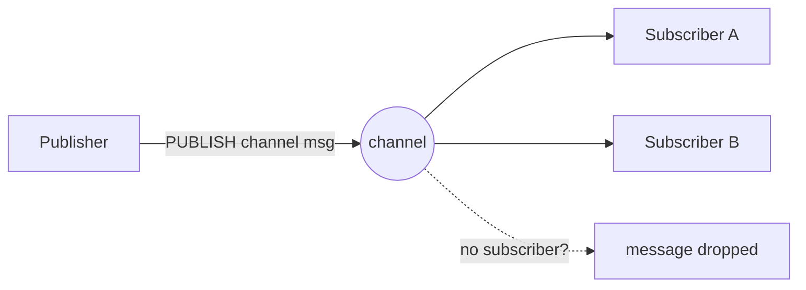
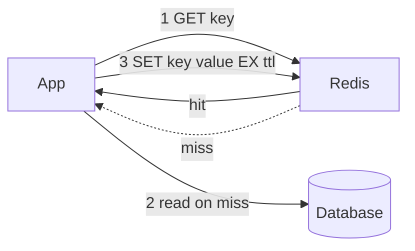
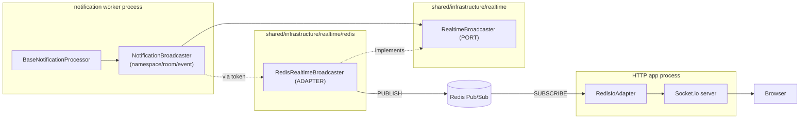

# Redis: Complete Reference + How We Use It (Real-Time WebSocket Backplane)

This document is a **beginner-to-pro Redis reference** *and* the explanation of
how Redis is used in this project. It is written so that after reading it you can
answer essentially any Redis interview question — what Redis is, how it works
internally, its data types, its messaging flows (pub/sub, streams, lists),
when to use which, persistence, eviction, scaling/HA, patterns, pros/cons — and
also explain precisely why it exists in *this* codebase and how the data flows.

Table of contents:

1. What Redis is (the basics)
2. How Redis works internally (single-threaded model, RESP, memory)
3. Core data types (with examples)
4. Persistence: RDB vs AOF
5. Expiry (TTL) and eviction policies
6. Messaging flows: Pub/Sub vs Streams vs Lists — when to use which
7. Common patterns / use cases (cache-aside, locks, rate limiting, ...)
8. Atomicity: transactions, Lua, pipelining
9. Scaling and high availability: replication, Sentinel, Cluster
10. Pros and cons — when to use / when NOT to use Redis
11. How THIS project uses Redis (the WebSocket backplane)
12. Interview Q&A
13. Command cheat-sheet

> **One-line mental model for this project:** RabbitMQ moves *durable business
> events* between modules; Redis moves *ephemeral "emit this to that room"
> commands* between processes so a browser can be reached from any of them;
> Postgres is the source of truth; WebSockets are the fast path; polling is the
> safety net.

---

## 1. What Redis is (the basics)

**Redis** (REmote DIctionary Server) is an **open-source, in-memory
data-structure store**. It keeps data in RAM (optionally persisted to disk), which
is why reads/writes are typically **sub-millisecond**. It can be used as:

- a **cache** (the most common use),
- a **database** (primary store for suitable workloads),
- a **message broker / pub-sub bus**,
- a **coordination primitive** (locks, rate limiters, counters).

Key characteristics:

- **In-memory first** → extremely fast, but the working set must fit in RAM.
- **Rich data types** → not just strings; lists, hashes, sets, sorted sets,
  streams, bitmaps, HyperLogLog, geo.
- **Single-threaded command execution** → each command is atomic; no locks
  needed for a single command.
- **Optional persistence** → RDB snapshots and/or AOF log.
- **Replication + clustering** → for HA and horizontal scale.

### Redis vs Memcached vs a relational DB

| | Redis | Memcached | Postgres/MySQL |
|---|---|---|---|
| Storage | In-memory (+ optional disk) | In-memory only | On-disk (durable) |
| Data types | Many (list/hash/set/zset/stream/...) | Strings only | Relational rows |
| Persistence | Yes (RDB/AOF) | No | Yes (ACID) |
| Pub/Sub, streams | Yes | No | LISTEN/NOTIFY only |
| Best for | Cache, real-time, coordination | Simple cache | System of record |

---

## 2. How Redis works internally

### Single-threaded event loop
Redis executes commands on a **single main thread** using an event loop
(multiplexing many client sockets). Consequences:

- **Every command is atomic** — while one command runs, no other command
  interleaves. You get atomicity "for free" for individual operations (e.g.
  `INCR`).
- **No per-key locking is needed** for a single command.
- **A slow command blocks everyone.** Commands like `KEYS *`, big `SORT`, large
  `LRANGE`, or a heavy Lua script stall all other clients. In production you
  avoid `KEYS` (use `SCAN`) and keep scripts short.
- Modern Redis offloads *some* work (I/O threads for network, background threads
  for `UNLINK`/fsync), but the command-execution model is still logically
  single-threaded.

### RESP protocol
Clients talk to Redis using **RESP** (REdis Serialization Protocol), a simple
text-based protocol over TCP (default port **6379**). Client libraries like
`ioredis` (which we use) implement it for you.

### Keyspace and memory
- Everything is a **key → value**, where the value is one of the data types.
- Keys are binary-safe strings; a common convention is `namespace:entity:id`
  (e.g. `order:123`, `session:abc`). This project follows that with rooms like
  `order:<uuid>`.
- Memory is bounded by `maxmemory`; when hit, an **eviction policy** decides what
  to drop (see §5).

---

## 3. Core data types (with examples)

Commands below are what you'd type in `redis-cli`.

### 3.1 String (also ints/floats/binary)
```
SET user:1:name "Ada"
GET user:1:name              # -> "Ada"
INCR page:views             # atomic counter -> 1, 2, 3...
SET session:abc "{...}" EX 3600   # value with 1h TTL
```
Use for: caching values/JSON blobs, counters, flags, tokens.

### 3.2 List (ordered, linked list; push/pop both ends)
```
LPUSH queue:jobs "job1"      # push left
RPUSH queue:jobs "job2"      # push right
LRANGE queue:jobs 0 -1       # read all
BRPOP queue:jobs 5           # BLOCKING pop (wait up to 5s) -> simple job queue
```
Use for: simple queues/stacks, recent-activity feeds.

### 3.3 Hash (map of field → value under one key)
```
HSET user:1 name "Ada" age 36
HGET user:1 name             # -> "Ada"
HGETALL user:1               # -> all fields
```
Use for: representing an object compactly (one key, many fields).

### 3.4 Set (unordered, unique members)
```
SADD tags:post:1 redis nosql
SISMEMBER tags:post:1 redis  # -> 1 (true)
SINTER tags:post:1 tags:post:2   # set intersection
```
Use for: uniqueness, membership tests, relationships, dedup.

### 3.5 Sorted Set / ZSet (unique members, each with a score, kept sorted)
```
ZADD leaderboard 100 "ada" 90 "linus"
ZREVRANGE leaderboard 0 9 WITHSCORES   # top 10
ZRANK leaderboard "ada"
```
Use for: leaderboards, priority queues, time-ordered data, rate limiting
(sliding window with timestamps as scores).

### 3.6 Bitmap
```
SETBIT active:2026-07-14 42 1   # user 42 was active today
BITCOUNT active:2026-07-14      # daily active count
```
Use for: compact boolean/analytics (daily active users, feature flags per user).

### 3.7 HyperLogLog (probabilistic unique count, ~12KB for billions)
```
PFADD visitors:home "u1" "u2" "u1"
PFCOUNT visitors:home           # approx unique count (~0.81% error)
```
Use for: approximate cardinality at scale (unique visitors) with tiny memory.

### 3.8 Streams (append-only log with consumer groups)
```
XADD orders * type placed orderId 123     # append entry, auto ID
XREAD COUNT 10 STREAMS orders 0            # read
XGROUP CREATE orders workers $             # consumer group
XREADGROUP GROUP workers c1 COUNT 10 STREAMS orders >
XACK orders workers <id>                   # acknowledge
```
Use for: durable event logs, work queues with **at-least-once** delivery,
replay, and consumer groups (a lightweight Kafka-like primitive).

### 3.9 Pub/Sub channels
```
SUBSCRIBE news            # client A listens
PUBLISH news "hello"      # client B publishes -> A receives "hello"
PSUBSCRIBE order:*        # pattern subscribe
```
Fire-and-forget: if no subscriber is listening at publish time, the message is
**gone** (no persistence). This is what Socket.io's Redis adapter uses under the
hood, and it is central to this project (§6, §11).

### 3.10 Geo (built on sorted sets)
```
GEOADD stores 77.59 12.97 "blr"
GEOSEARCH stores FROMLONLAT 77.6 12.9 BYRADIUS 5 km ASC
```
Use for: "nearby" queries.

---

## 4. Persistence: RDB vs AOF

Redis is in-memory but can persist to disk so data survives restarts.

| Mode | What it is | Pros | Cons |
|------|-----------|------|------|
| **RDB** (snapshot) | Point-in-time binary dump every N seconds/changes | Compact, fast restart, good for backups | Can lose the last few minutes of writes on crash |
| **AOF** (append-only file) | Logs every write command; replayed on restart | Much more durable (fsync every sec or every write) | Larger files, slightly slower, longer restart |
| **Hybrid** (default in modern Redis) | RDB base + AOF tail | Best of both | — |

Durability is a **spectrum**: `appendfsync everysec` (default) risks ~1s of data
on crash; `always` is safest but slowest. For a **cache** you often disable
persistence entirely. For our WebSocket backplane, persistence does not matter —
the messages are ephemeral (a dropped live animation is acceptable; Postgres is
the durable record).

---

## 5. Expiry (TTL) and eviction policies

### TTL (time to live)
```
SET otp:123 "999" EX 300     # expires in 300s
TTL otp:123                  # seconds remaining
PERSIST otp:123              # remove expiry
```
Redis expires keys **lazily** (on access) and via a **background sampler**.

### Eviction (when maxmemory is reached)
Set `maxmemory` and a `maxmemory-policy`:

| Policy | Behavior |
|--------|----------|
| `noeviction` | Reject writes with an error (default) |
| `allkeys-lru` | Evict least-recently-used key (any key) |
| `allkeys-lfu` | Evict least-frequently-used key (any key) |
| `volatile-lru` / `volatile-lfu` | Same but only among keys with a TTL |
| `allkeys-random` / `volatile-random` | Evict random keys |
| `volatile-ttl` | Evict keys with the nearest expiry |

For a pure cache, `allkeys-lru` (or `-lfu`) is typical. For a store where losing
data is unacceptable, `noeviction` + capacity planning.

### Cache stampede
When a hot key expires, many requests miss simultaneously and hammer the DB.
Mitigations: randomized TTLs (jitter), locking/`SETNX` so one request rebuilds
while others wait, or "stale-while-revalidate".

---

## 6. Messaging flows: Pub/Sub vs Streams vs Lists

This is the section interviewers probe most, and it is the heart of how we use
Redis. Redis offers **three** messaging styles with very different guarantees.

### 6.1 Pub/Sub (fire-and-forget fan-out)



- Every current subscriber gets every message; **no storage, no replay, no ack.**
- If a subscriber is offline at publish time, it misses the message forever.
- Extremely low latency; perfect for **ephemeral broadcast**.
- **This is what we use** (via the Socket.io Redis adapter/emitter). A missed
  live UI update is acceptable because the durable truth is in Postgres.

### 6.2 Streams (durable log + consumer groups)

- Messages are **stored** in an append-only log with IDs; consumers can **replay**
  from any point.
- **Consumer groups** give at-least-once delivery, per-consumer cursors, and
  acknowledgements (`XACK`) — like a lightweight Kafka.
- Use when you need durability, replay, or guaranteed processing.

### 6.3 Lists as queues (BLPOP/BRPOP)

- Simple work queue: producers `LPUSH`, workers `BRPOP` (block until a job
  arrives). At-most-once unless you add reliable-queue patterns
  (`LMOVE`/`BRPOPLPUSH` into a processing list).
- Good for basic background jobs when you don't need Streams' features.

### Decision table — when to use which

| Need | Use |
|------|-----|
| Ephemeral live broadcast to whoever is connected now | **Pub/Sub** |
| Durable events, replay, consumer groups, guaranteed processing | **Streams** |
| Simple FIFO job queue | **List + BRPOP** |
| Cross-process WebSocket fan-out (our case) | **Pub/Sub** (via Socket.io adapter) |
| Guaranteed business event delivery (our sagas) | Not Redis — **RabbitMQ** with outbox/inbox |

> Note the deliberate split in this project: **RabbitMQ** for durable business
> events (with the outbox/inbox patterns), **Redis Pub/Sub** for ephemeral
> real-time presentation. Using the right tool for each guarantee level is itself
> a strong design signal.

---

## 7. Common patterns / use cases (with examples)

### 7.1 Cache-aside (lazy caching) — the #1 use of Redis

```
value = GET product:1
if value is null:
   value = db.query(...)
   SET product:1 <value> EX 300
return value
```
Also: **write-through** (write cache + DB together) and **write-behind** (write
cache now, DB async).

### 7.2 Session store
Store server-side sessions as a String/Hash with a TTL; every app instance
shares them → stateless, horizontally scalable web tier.

### 7.3 Rate limiting
- Fixed window: `INCR user:42:req` + `EXPIRE 60`; reject if `> limit`.
- Sliding window: a ZSet of request timestamps; trim old, count remaining.

### 7.4 Distributed lock
```
SET lock:resource <token> NX PX 10000    # acquire only if absent, 10s TTL
# ... do work ...
# release ONLY if token matches (Lua, to be atomic)
```
Single-instance locks are simple; multi-node correctness needs **Redlock** and
comes with caveats (clock skew, GC pauses) — mention this nuance in interviews.

### 7.5 Leaderboards / counters / dedup / fan-out
- Leaderboard → ZSet (`ZADD`/`ZREVRANGE`).
- Counters → `INCR`/`HINCRBY` (atomic).
- Dedup → Set membership.
- Real-time fan-out → Pub/Sub (our case).

---

## 8. Atomicity: transactions, Lua, pipelining

- **MULTI/EXEC** — queue commands, execute atomically as a block.
  **WATCH** a key for optimistic locking (abort if it changed).
  ```
  WATCH balance
  MULTI
  DECRBY balance 10
  EXEC        # fails if balance changed since WATCH
  ```
- **Lua scripting** (`EVAL`) — run multiple commands atomically server-side in
  one round trip (used for correct lock release, complex rate limiters).
- **Pipelining** — send many commands without waiting for each reply, cutting
  network round trips (throughput optimization, not atomicity).

Because Redis is single-threaded, a MULTI/EXEC block or a Lua script runs with no
other command interleaving.

---

## 9. Scaling and high availability

### Replication (primary/replica)
One **primary** handles writes; **replicas** copy its data and serve reads.
Async by default → replicas can lag slightly. Improves read scale + redundancy.

### Sentinel (automatic failover)
**Redis Sentinel** monitors primary/replicas and, if the primary dies, promotes
a replica and updates clients. Gives HA without sharding.

### Cluster (horizontal sharding)
**Redis Cluster** shards the keyspace across nodes using **16384 hash slots**
(each key maps to a slot via CRC16). Scales writes/memory beyond one machine.
Trade-off: multi-key operations must involve keys in the same slot (use hash
tags `{...}`), and it is more operationally complex.

| Goal | Solution |
|------|----------|
| Read scaling + redundancy | Replication |
| Automatic failover (HA) | Sentinel |
| Write/memory scaling (sharding) | Cluster |

For this project a **single Redis node** is plenty (dev/demo). In production you
would add Sentinel or a managed Redis (ElastiCache/MemoryStore/Upstash).

---

## 10. Pros and cons

**Pros**
- Blazing fast (in-memory, sub-ms).
- Versatile data types → many problems solved with one tool.
- Atomic operations, Lua, transactions.
- Pub/Sub + Streams for messaging.
- Mature replication/Sentinel/Cluster + managed offerings.

**Cons / caveats**
- Data must (mostly) fit in RAM → cost at large scale.
- Single-threaded → one slow command hurts everyone; avoid `KEYS`, huge ops.
- Pub/Sub has **no durability** (use Streams if you need it).
- Persistence is configurable but not full ACID like an RDBMS.
- Cluster adds multi-key/operational constraints.

**When to use:** caching, sessions, rate limiting, leaderboards, real-time
fan-out, locks, ephemeral high-throughput data.

**When NOT to use (alone):** as the sole system of record for critical relational
data, for guaranteed-delivery business messaging (use a real broker), or when the
dataset vastly exceeds affordable RAM.

---

## 11. How THIS project uses Redis (the WebSocket backplane)

### 11.1 The problem: WebSocket connections are stuck inside one process
WebSocket (Socket.io) connections are **stateful** and live **in the memory of
one process** — the HTTP application ([modules/main.ts](../modules/main.ts), port
8080), where browsers connect. Rooms like `order:123` are in-memory maps inside
that process.

But our backend is **many processes** (see `rabbitmq-setup.md` and
[start-workers.sh](../../start-workers.sh)):

```
┌──────────────────────────────┐     ┌───────────────────────────────────────┐
│  HTTP App  (modules/main.ts)  │     │  CLI Workers (start-workers.sh)         │
│  - REST API                   │     │  - handle-messages --module=order       │
│  - Socket.io server  ◄─────── │ ... │  - handle-messages --module=payment      │
│  - Browsers connect HERE      │     │  - handle-messages --module=notification │  ◄── events arrive HERE
│  - Rooms live HERE            │     │  - dispatch-messages --module=... (relay)│
└──────────────────────────────┘     └───────────────────────────────────────┘
```

The saga's terminal consumer — the **notification consumer**
(`handle-messages --module=notification`) — receives every domain event, writes a
`Notification` row, and must push a live update to the browser. But that worker is
a **separate process with no Socket.io server**: it owns no browser connections
and knows nothing about the `order:123` rooms. So a direct emit does nothing.

```
        EVENTS LIVE HERE                         SOCKETS LIVE HERE
   ┌───────────────────────┐                ┌───────────────────────┐
   │ notification worker    │   no bridge    │ HTTP app               │
   │ has the event          │  ────────────► │ has the browser socket │
   │ has NO socket server   │                │ has NO event           │
   └───────────────────────┘                └───────────────────────┘
```

### 11.2 The solution: Redis Pub/Sub as the Socket.io backplane
We use the official **`@socket.io/redis-adapter`** (on the HTTP app) and
**`@socket.io/redis-emitter`** (in any process). The worker publishes an
"emit to room X" command to Redis; the HTTP app's Socket.io server receives it and
delivers to the browsers it holds.



### 11.3 Ports & Adapters (why the code is shaped this way)
The realtime capability is decoupled using **hexagonal architecture** (matching
the repo's existing `*.interface.ts` port pattern):

- **Port (interface):** `RealtimeBroadcaster.broadcastToRoom(namespace, room, event, payload)` — technology-agnostic contract.
- **Adapter (Redis impl):** `RedisRealtimeBroadcaster` implements the port using `@socket.io/redis-emitter`.
- **Module-owned wrapper:** `NotificationBroadcaster` holds the notification-specific contract (`/notifications`, `order:<id>`, `notification` event, payload shape) and calls the port.

This removes the previous coupling where shared infrastructure knew about the
notification module, and makes the transport swappable (Redis → Kafka/NATS/
in-memory) by changing only the `useClass` binding — no feature module changes.

### 11.4 Do we send an "event" or a "notification"?
Two different messages on two different transports:

| Hop | Transport | Payload | Producer | Consumer |
|-----|-----------|---------|----------|----------|
| Producer → Consumer | RabbitMQ (AMQP) | **Domain event** (`PaymentCompletedEvent`, full envelope) | Order/Inventory/Payment/Shipping modules | Notification consumer |
| Consumer → Browser | Redis → WebSocket | **Notification** (`{ orderId, eventType, message, occurredAt }`) | `NotificationBroadcaster` | Browser (Redux `telemetry` slice) |

The browser never receives raw domain events and never touches RabbitMQ. The
notification consumer is the bridge/translator between AMQP and WebSockets.

### 11.5 End-to-end flow
```
1. Browser ─POST /api/orders──────────────► HTTP App (Order module)
2. Browser ─socket.emit("subscribeToOrder",{orderId})──► HTTP App NotificationGateway
       gateway: client.join("order:<id>")   (room membership shared via Redis adapter)
3. Order module writes Order + OutboxMessage (same DB tx)          [Transactional Outbox]
4. dispatch-messages(order) relays outbox row ─► RabbitMQ (order-exchange)
5. RabbitMQ routes OrderPlacedEvent ─► inventory-queue AND notification-queue
6. handle-messages(notification) consumes OrderPlacedEvent:
       a. persist Notification row (+ inbox idempotency)           [Transactional Inbox]
       b. NotificationBroadcaster.broadcastToOrder(...)
             └─► RealtimeBroadcaster.broadcastToRoom("/notifications","order:<id>","notification",{...})
                   └─► RedisRealtimeBroadcaster → PUBLISH to Redis
7. Redis delivers the command to every subscribed Socket.io server
8. HTTP App's Socket.io server (RedisIoAdapter) emits "notification" to sockets in room "order:<id>"
9. Browser receives "notification" ─► telemetry slice ─► topology animates + Event Flow Log updates
```

### 11.6 Files and wiring

| Concern | File | Role |
|---------|------|------|
| Redis service | [docker-compose.yml](../docker-compose.yml) (`redis`) | Runs Redis 7 on the shared network |
| Config | [app.config.ts](../modules/shared/src/infrastructure/config/app.config.ts) (`redisConfig`) | Reads `REDIS_HOST` / `REDIS_PORT` |
| Port (interface) | `modules/shared/src/infrastructure/realtime/realtime-broadcaster.interface.ts` | `RealtimeBroadcaster` + `REALTIME_BROADCASTER` token |
| Redis adapter | `modules/shared/src/infrastructure/realtime/redis/redis-realtime-broadcaster.service.ts` | Publishes emit commands via `@socket.io/redis-emitter` |
| Socket.io adapter | `modules/shared/src/infrastructure/realtime/redis/redis-io.adapter.ts` | Attaches `@socket.io/redis-adapter` to the Socket.io server |
| DI binding | `modules/shared/src/infrastructure/realtime/realtime.module.ts` (re-exported by `SharedModule`) | Binds the port to the Redis adapter |
| Module wrapper | `modules/notification/src/infrastructure/realtime/notification-broadcaster.service.ts` | Owns namespace/room/event/payload; calls the port |
| Gateway (inbound) | `modules/notification/src/infrastructure/websocket/notification.gateway.ts` | Handles `subscribeToOrder` only; no broadcasting |

### 11.7 Why broadcasting always goes through Redis (even in the HTTP app)
`NotificationBroadcaster` never uses a local socket server; it always goes through
the port → Redis. This keeps the broadcast path identical in every process and
**correct with multiple HTTP replicas**: an emit published to Redis reaches all
replicas, so a client connected to replica B still receives an event emitted from
a worker or from replica A.

### 11.8 Key prefix must match
The adapter and emitter communicate through Redis keys/channels with a shared
prefix (default `socket.io`). Both use the default here. If you set a custom
prefix on one, set the same on the other or messages silently disappear.

### 11.9 Config and running

`.env`:
```env
REDIS_HOST=order-engine-redis   # docker service name on the shared network
REDIS_PORT=6379
REDIS_FORWARD_PORT=6379          # host port mapping for local tooling
```
```bash
docker compose up -d            # starts postgres, rabbitmq, redis, backend
./start-workers.sh              # starts consumers + dispatchers (incl. notification)

docker exec -it order-engine-redis redis-cli ping     # -> PONG
docker exec -it order-engine-redis redis-cli monitor  # watch pub/sub traffic live
```
Debug order if real-time looks dead: (1) Redis running, (2) HTTP app logged
`Socket.io Redis adapter connected`, (3) worker logged `Realtime broadcaster
connected to Redis`, (4) browser socket `connected` (status pill in the console's
Observability Deck).

### 11.10 Alternatives we considered

| Option | Pros | Cons | Verdict |
|--------|------|------|---------|
| **A. Socket.io Redis adapter/emitter** (chosen) | Canonical, scales to N replicas + N workers, minimal code, graceful degradation | Adds Redis infra | ✅ Best fit |
| B. Run notification consumer inside the HTTP app | Zero new infra | Breaks worker/app separation; can't scale HTTP app horizontally | Toy-only |
| C. RabbitMQ as WS backplane | Reuses broker | Still needs the adapter for >1 HTTP replica; more glue | Reinvents the adapter |
| D. Kafka/NATS backplane | Great at huge scale/replay | Heavier than needed | Overkill |
| E. Poll DB only (no WS) | Dead simple | Not real-time | Kept as **fallback** |

We keep option E as a safety net: if Redis is down, the live topology stops
animating but the DB-backed ledger still updates via 3s polling → graceful
degradation.

---

## 12. Interview Q&A

**Q: What is Redis and when would you use it?**
In-memory data-structure store; use it for caching, sessions, rate limiting,
leaderboards, real-time pub/sub, locks, and other fast/ephemeral workloads.

**Q: Why is Redis so fast?**
Data lives in RAM and commands run on a single thread with an efficient event
loop and simple protocol — no disk seeks, no lock contention per command.

**Q: Redis is single-threaded — isn't that a bottleneck?**
For most workloads no, because operations are memory-speed. It also means each
command is atomic. The risk is a single slow command (e.g. `KEYS *`) blocking
everyone, so you avoid those and can scale out with Cluster.

**Q: How do you scale WebSockets across multiple servers?** *(the classic)*
A single WS server keeps connections/rooms in local memory, so a broadcast on
server A never reaches a client on server B. Add a **backplane** (Redis pub/sub
adapter for Socket.io) so every server publishes/subscribes room events through
Redis and can fan out to clients it doesn't hold. That is exactly what
`RedisIoAdapter` + `RedisRealtimeBroadcaster` do here.

**Q: Why can't the worker emit directly to the browser?**
WebSocket connections and rooms are in-memory state owned by the process that
accepted the connection (the HTTP app). The worker is a different process with no
sockets, so it must publish to a shared bus (Redis) that the HTTP app consumes.

**Q: Difference between the Redis adapter and the Redis emitter?**
The **adapter** runs on a full Socket.io server and both publishes and subscribes
(participates in delivery). The **emitter** is a server-less client for non-socket
processes (our worker) that can only **publish** emit commands.

**Q: Pub/Sub vs Streams vs a list-queue — when each?**
Pub/Sub = ephemeral fire-and-forget fan-out (no persistence/replay) → live UI.
Streams = durable log + consumer groups + replay → guaranteed processing.
List + BRPOP = simple FIFO job queue.

**Q: What delivery guarantees does Redis Pub/Sub give?**
At-most-once, no persistence: offline subscribers miss messages. That's fine for
our live hints; guaranteed business delivery uses RabbitMQ + outbox/inbox.

**Q: RDB vs AOF?**
RDB = periodic snapshot (compact, may lose recent writes). AOF = append every
write (more durable, larger/slower). Modern default is hybrid.

**Q: What are eviction policies?**
When `maxmemory` is hit, Redis drops keys per `maxmemory-policy`
(`noeviction`, `allkeys-lru`, `allkeys-lfu`, `volatile-*`, ...). Caches use LRU/
LFU; systems that can't lose data use `noeviction`.

**Q: How do you do a distributed lock in Redis? Caveats?**
`SET key token NX PX ttl` to acquire; release via Lua that checks the token.
Multi-node correctness needs Redlock and still has caveats (clock skew, pauses).

**Q: How is atomicity achieved beyond single commands?**
MULTI/EXEC (+ WATCH for optimistic locking) and Lua scripts, both of which run
without interleaving thanks to the single-threaded model. Pipelining is for
throughput, not atomicity.

**Q: How does Redis Cluster shard data?**
16384 hash slots; each key → slot via CRC16; slots distributed across nodes.
Multi-key ops need same-slot keys (hash tags).

**Q: Why Redis here instead of just RabbitMQ?**
RabbitMQ already carries durable business events. The missing piece was
cross-process delivery into live WebSocket rooms — an ephemeral fan-out problem
that Redis pub/sub + the Socket.io adapter solve idiomatically. Different
guarantee levels, different tools.

**Q: What happens if Redis goes down?**
Live broadcasts stop, but nothing crashes: notifications still persist to
Postgres and the frontend's 3s polling keeps the UI eventually consistent
(graceful degradation).

**Q: How would you secure this in production?**
Authenticated WS handshake (JWT) before `subscribeToOrder`, verify order
ownership before `client.join`, Redis AUTH/TLS on a private network, restrict CORS
(currently `*` for the demo).

---

## 13. Command cheat-sheet

```
# Strings / counters
SET k v [EX secs] [NX]      GET k       INCR k      DECR k      APPEND k v

# Keys / TTL
DEL k        EXISTS k       EXPIRE k 60      TTL k       PERSIST k
SCAN 0 MATCH order:* COUNT 100     # NEVER use KEYS in prod

# Hash
HSET k f v   HGET k f   HGETALL k   HDEL k f   HINCRBY k f 1

# List (queue)
LPUSH k v    RPUSH k v   LRANGE k 0 -1   BRPOP k 5   LLEN k

# Set
SADD k v     SISMEMBER k v   SMEMBERS k   SINTER a b   SCARD k

# Sorted set (leaderboard)
ZADD k 100 m   ZREVRANGE k 0 9 WITHSCORES   ZRANK k m   ZSCORE k m

# Pub/Sub
SUBSCRIBE ch     PSUBSCRIBE order:*     PUBLISH ch msg

# Streams
XADD s * field v    XREAD COUNT 10 STREAMS s 0
XGROUP CREATE s g $   XREADGROUP GROUP g c STREAMS s >   XACK s g <id>

# Transactions / scripting
MULTI ... EXEC     WATCH k     EVAL "return 1" 0

# Ops
PING     INFO     MONITOR     DBSIZE     FLUSHALL (danger)     CONFIG GET maxmemory
```

---

### See also
- [rabbitmq-setup.md](./rabbitmq-setup.md) — durable business event bus (outbox/inbox, retries, DLQ).
- [websocket-setup.md](./websocket-setup.md) — Socket.io namespaces, rooms, subscription flow.
- [project-context.md](./project-context.md) — overall stack and architecture.
